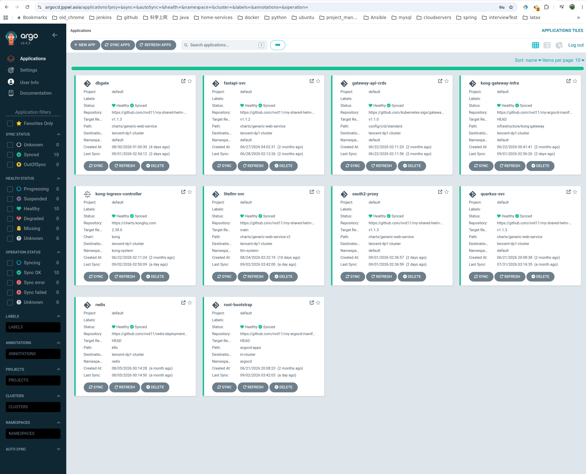

# ArgoCD GitOps Manifests (`my-argocd-manifests`)

This repository serves as the centralized GitOps Continuous Delivery (CD) control repository for Kubernetes cluster workloads. It manages cluster infrastructure, ingress routing, zero-trust authentication, and microservice deployments using declarative ArgoCD Application manifests.

---

## 1. System Architecture

The delivery workflow separates infrastructure layers, ingress gateways, and application workloads across multiple Kubernetes nodes and clusters.

```
+-----------------------------------------------------------------------------------+
|                            GitOps Control Plane (ArgoCD)                          |
|                                                                                   |
|  +-----------------------------------------------------------------------------+  |
|  |             Root App-of-Apps (argocd-apps/root-bootstrap-app.yaml)          |  |
|  +--------------------------------------+--------------------------------------+  |
+-----------------------------------------|-----------------------------------------+
                                          |
                      +-------------------+-------------------+
                      |                   |                   |
                      v                   v                   v
              [Sync Wave 1: CRDs] [Sync Wave 2: Ingress]  [Sync Wave 3+: Apps]
             Gateway API Standard   Kong Controller &    OAuth2-Proxy, LiteLLM,
                  v1.1.0 CRDs         Custom Lua Plugins   DbGate, FastAPI, Redis
                                          |
                                          v
+-----------------------------------------------------------------------------------+
|                 Edge Gateway & Zero-Trust Authentication Layer                     |
|                                                                                   |
|  1. Browser UI Traffic (/ui, /dbgate, /key) -> Kong Gateway -> Lua Forward-Auth   |
|     -> Subrequest to OAuth2-Proxy:4180 -> Logto IdP (GitHub/WeChat OAuth)         |
|                                                                                   |
|  2. Inference API Traffic (/litellm/v1/*) -> Kong Gateway -> LiteLLM Pod          |
|     (Direct Bearer token passthrough, 0ms overhead, bypasses OAuth2-Proxy)        |
+-----------------------------------------------------------------------------------+
```

### ArgoCD Cluster Dashboard



*All 10 cluster workloads deployed and managed in a Healthy/Synced state across target clusters via ArgoCD GitOps.*

---

## 2. Directory Layout

```
my-argocd-manifests/
├── .github/
│   └── workflows/
│       ├── update-image-tag.yml          # Repository dispatch workflow for image tag updates
│       └── update-app-image-digest.yml   # Repository dispatch workflow for image digest updates
│
├── argocd-apps/                          # Declarative ArgoCD Application manifests
│   ├── root-bootstrap-app.yaml           # Root App-of-Apps controller
│   ├── gateway-api-crds-app.yaml         # Kubernetes Gateway API v1.1.0 standard CRDs (Wave 1)
│   ├── kong-controller-app.yaml          # Kong Ingress Controller Helm deployment (Wave 2)
│   ├── kong-infra-app.yaml               # Gateway, GatewayClass, and Lua plugins (Wave 2)
│   ├── oauth2-proxy-app.yaml             # OAuth2-Proxy OIDC authentication engine
│   ├── redis-app.yaml                    # Redis caching and state backend (Wave 3)
│   ├── dbgate-app.yaml                   # DbGate web database manager (OAuth2 protected)
│   ├── litellm-svc-app.yaml              # LiteLLM gateway (Split route: UI vs Inference API)
│   ├── fastapi-svc-app.yaml              # Sample FastAPI microservice
│   └── quarkus-svc-app.yaml              # Sample Quarkus microservice
│
├── infrastructure/
│   └── kong-gateway/
│       ├── GatewayClass.yaml             # Gateway API GatewayClass definition
│       ├── Gateway.yaml                  # kong-main-gateway definition (Port 80 listener)
│       ├── custom-auth-plugin.yaml       # Legacy basic-auth Lua plugin (reference)
│       └── oauth2-forward-auth-plugin.yaml # Custom Lua forward-auth plugin (ConfigMap + CRDs)
│
└── docs/
    ├── images/
    │   └── argocd-dashboard.png        # ArgoCD Applications dashboard screenshot
    ├── kong-logto-github-sso-deep-dive-blog.md # Technical deep dive on Kong + Logto GitHub SSO
    └── kong-logto-wechat-sso-plan.md           # Architecture plan for Logto WeChat SSO integration
```

---

## 3. Core Architectural Components

### 3.1 App-of-Apps Pattern and Sync Ordering
The root application (`argocd-apps/root-bootstrap-app.yaml`) watches the `argocd-apps/` directory. Adding or updating a manifest in that directory automatically reconciles the corresponding child application.

Manifests use ArgoCD sync waves to enforce provisioning order:
1. **Wave 1 (`gateway-api-crds-app.yaml`)**: Deploys standard Kubernetes Gateway API CRDs (`v1.1.0`) using Server-Side Apply to avoid annotation size limits.
2. **Wave 2 (`kong-controller-app.yaml` & `kong-infra-app.yaml`)**: Deploys Kong Ingress Controller and mounts custom Lua plugins via ConfigMaps.
3. **Wave 3+ (Workloads)**: Deploys core infrastructure (Redis, OAuth2-Proxy) followed by business workloads and ingress routing rules.

### 3.2 Kong Gateway and Zero-Trust Authentication
The ingress layer uses **Kong OSS** coupled with **Logto** (OIDC Identity Provider) and **OAuth2-Proxy** to deliver single sign-on without requiring Kong Enterprise plugins.

- **Custom Lua Forward-Auth Plugin** (`infrastructure/kong-gateway/oauth2-forward-auth-plugin.yaml`):
  During the `access` phase, the plugin sends a subrequest to `http://oauth2-proxy.default.svc.cluster.local:4180/oauth2/auth` with the client's cookies.
  - On `200` or `202`: Kong forwards the request to the target pod with identity headers (`X-Auth-Request-User`).
  - On `401` or `403`: Returns a `302 Redirect` to `/oauth2/start` for browser requests, or an HTTP 401 JSON payload for API/AJAX requests (`Accept: application/json`).
- **Identity Claim Mapping**: Configured with `user_id_claim="sub"` and `oidc_email_claim="sub"` in OAuth2-Proxy. This ensures social identity providers (such as WeChat or GitHub accounts without public emails) authenticate cleanly without missing-email errors.
- **Session Lifecycle**: Integrates with Logto's OIDC End-Session endpoint (`/oidc/session/end`) to ensure complete logout across both local cookies and IdP sessions.

### 3.3 Traffic Splitting: UI Protection vs API Passthrough
LiteLLM (`argocd-apps/litellm-svc-app.yaml`) handles two distinct traffic types:
1. **Administrative UI and Management Endpoints** (`extraRoutes.ui-route`):
   Matches `/ui`, `/_next/*`, `/key/*`, `/user/*`, `/models/*`, and `/spend/*`. Protected by the `oauth2-forward-auth` plugin.
2. **Model Inference API** (`route`):
   Matches `/litellm/v1/*`. Bypasses OAuth2-Proxy entirely with no auth plugin attached, allowing external scripts and coding agents to authenticate directly via `Authorization: Bearer sk-...` with 0ms added latency.

---

## 4. Application Workloads Inventory

| Application | Manifest Path | Base Chart / Source | Target Namespace | Target Node | Access Policy |
| :--- | :--- | :--- | :--- | :--- | :--- |
| **Gateway API CRDs** | `argocd-apps/gateway-api-crds-app.yaml` | `kubernetes-sigs/gateway-api` (`v1.1.0`) | `default` | Any | Cluster Infrastructure |
| **Kong Controller** | `argocd-apps/kong-controller-app.yaml` | `charts.konghq.com/kong` (`2.38.0`) | `kong-system` | DaemonSet | Cluster Infrastructure |
| **Kong Infra** | `argocd-apps/kong-infra-app.yaml` | `infrastructure/kong-gateway` | `default` | Any | Gateway & Plugins |
| **OAuth2-Proxy** | `argocd-apps/oauth2-proxy-app.yaml` | `charts/generic-web-service` (`v1.1.3`) | `default` | `vm-0-2-debian` | Public (`/oauth2/*`) |
| **Redis** | `argocd-apps/redis-app.yaml` | `nvd11/redis-deployment/k8s` | `redis` | Any | Internal |
| **DbGate** | `argocd-apps/dbgate-app.yaml` | `charts/generic-web-service` (`v1.1.3`) | `default` | `nuc` | OAuth2 Protected (`/dbgate/*`) |
| **LiteLLM** | `argocd-apps/litellm-svc-app.yaml` | `charts/generic-web-service-v2` (`main`) | `llm-system` | `free-arm-vm` | Split: OAuth2 UI / Direct API |
| **FastAPI Service** | `argocd-apps/fastapi-svc-app.yaml` | `charts/generic-web-service` (`v1.1.2`) | `default` | Any | Public (`/svc2`) |
| **Quarkus Service** | `argocd-apps/quarkus-svc-app.yaml` | `charts/generic-web-service` (`v1.1.3`) | `default` | `nuc` | Public (`/svc1`) |

---

## 5. Automated CI/CD Image Promotion

Upstream application repositories trigger image updates in this repository via GitHub Actions `repository_dispatch` events.

```
+------------------------+       repository_dispatch       +-------------------------+
| Upstream CI Repository | ------------------------------> |   my-argocd-manifests   |
| (Builds & Pushes Image)|   (event: update-image-tag /    |  (.github/workflows/)   |
+------------------------+    update-app-image-digest)     +------------+------------+
                                                                        |
                                                                        | sed update & git push
                                                                        v
                                                           +-------------------------+
                                                           | ArgoCD Cluster Sync     |
                                                           | (Pulls new tag/digest)  |
                                                           +-------------------------+
```

### 5.1 Tag-Based Updates (`update-image-tag.yml`)
Triggered when an upstream build completes:
```bash
curl -X POST \
  -H "Accept: application/vnd.github.v3+json" \
  -H "Authorization: token ${{ secrets.DISPATCH_TOKEN }}" \
  https://api.github.com/repos/nvd11/my-argocd-manifests/dispatches \
  -d '{
    "event_type": "update-image-tag",
    "client_payload": {
      "svc_name": "quarkus-svc",
      "image_tag": "2fc15c18670d0dab2b1f89f67b4db28b39b25726"
    }
  }'
```
The workflow updates `image.tag` inside `argocd-apps/${svc_name}-app.yaml` and pushes a commit back to `main`.

### 5.2 Digest-Based Updates (`update-app-image-digest.yml`)
For workloads requiring immutable digest pinning (e.g., LiteLLM):
```bash
curl -X POST \
  -H "Accept: application/vnd.github.v3+json" \
  -H "Authorization: token ${{ secrets.DISPATCH_TOKEN }}" \
  https://api.github.com/repos/nvd11/my-argocd-manifests/dispatches \
  -d '{
    "event_type": "update-app-image-digest",
    "client_payload": {
      "svc_name": "litellm-svc",
      "image_digest": "sha256:445a0f7615095b1beb7b86a7f2a96a6b34de8ed67fa63fcffd2d0ee7e1e3534b"
    }
  }'
```
The workflow verifies the SHA256 digest format and updates the manifest.

---

## 6. Operations Guide

### Adding a New Service
1. **Create the ArgoCD Application manifest** in `argocd-apps/<your-service>-app.yaml` referencing `my-shared-helm-charts` (or your application chart).
2. **Configure HTTP routing**:
   - For standard public or internal services, define `route` pointing to `kong-main-gateway`.
   - For SSO-protected endpoints, add `annotations: { konghq.com/plugins: oauth2-forward-auth }`.
3. **Commit and push** to `main`. ArgoCD's root bootstrap application will automatically detect and synchronize the new application.

### Verifying Gateway Routing and Auth
```bash
# Test unauthenticated UI access (expects 302 to /oauth2/start)
curl -s -I https://gw.jppwl.asia/dbgate/
curl -s -I https://gw.jppwl.asia/ui/

# Test unauthenticated AJAX/API access (expects 401 JSON)
curl -s -i -H "Accept: application/json" https://gw.jppwl.asia/key/list

# Test LiteLLM direct API passthrough (expects 401 directly from LiteLLM, not 302 redirect)
curl -s -X GET https://gw.jppwl.asia/litellm/v1/models
```

---

## 7. Documentation Index

- [Production Guide: Zero-Trust GitHub SSO Deep Dive](docs/kong-logto-github-sso-deep-dive-blog.md)
- [Architecture Plan: Logto OAuth2 + WeChat SSO Integration](docs/kong-logto-wechat-sso-plan.md)
