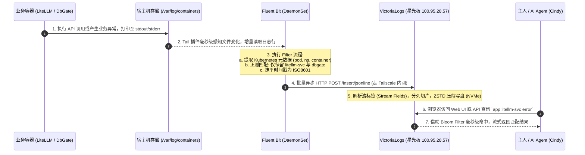

# 技术方案与实施计划：K3s 集群日志体系建设与集中查询 (Fluent Bit + 星光板 VictoriaLogs)

- **文档版本**：v1.0.0 (实施规划初版)
- **更新时间**：2026-09-05
- **交付仓库**：`https://github.com/nvd11/my-argocd-manifests`
- **目标集群**：腾讯云业务集群 `tencent-dp1-cluster` (及后续各业务节点)
- **首批接入服务**：`litellm-svc` (大模型统一网关) 与 `dbgate` (数据库管理终端)
- **日志存储中心**：本地局域网星光板 (Starfive RISC-V · 120GB NVMe SSD · Tailscale `100.95.20.57`)

---

## 1. 方案背景与架构目标

### 1.1 现状与痛点
1. **日志分散难以集中追溯**：目前集群中的微服务分布在不同的物理/云节点（如 `litellm-svc` 位于 OCI 新加坡的 `free-arm-vm`，`dbgate` 位于广州本地的 `nuc`）。排查问题需要分别通过 `kubectl logs` 或登录不同节点查看，缺乏跨节点、统一时间轴的集中检索看板；
2. **容器重启日志丢失风险**：K3s 节点容器发生崩溃、重启或滚动更新后，历史 `stdout` 日志容易被节点清理轮转，无法进行事后复盘和长期趋势审计；
3. **计算与存储资源精细化诉求**：集群中部分云节点内存偏紧凑（如 1C1G、2C2G），且公有云磁盘价格昂贵或有回收风险；而本地局域网的星光板（Starfive RISC-V）刚挂载了 **120GB 高速 NVMe SSD**，剩余可用空间高达 **89GB+**，算力闲置，是承接全集群日志落盘的最佳天然硬件黑匣子。

### 1.2 核心架构目标
1. **零业务侵入 (Zero Intrusiveness)**：业务应用（Python FastAPI、Node.js 等）无需引入任何日志 SDK 或改造代码，继续保持标准 `stdout/stderr` 输出；
2. **极致轻量级采集**：采用 C 语言编写的 **Fluent Bit** 以 DaemonSet 模式运行，单 Pod 内存消耗控制在 **20MB~30MB** 以内，CPU 占用低于 1%，绝不挤占业务算力；
3. **安全跨云内网直连 (Tailscale Zero Trust)**：跨公网的 OCI 节点与本地星光板之间通过 **Tailscale 虚拟专网** 进行加密传输，不暴露公网写入端口，免去繁复的防火墙公网白名单管理；
4. **超高压缩与极速检索**：利用 VictoriaLogs 的列式存储与 ZSTD 算法（10:1 到 20:1 压缩比），实现数月日志轻松存储，并通过其原生 Web UI (`/select/vmui/`) 与 HTTP LogsQL API 满足秒级交互与自动化调用需求；
5. **声明式 GitOps 交付**：全套采集配置纳管于当前仓库 `my-argocd-manifests`，由阿里云 ArgoCD 控制面统一分发，配置版本化、可回滚、自愈。

---

## 2. 总体架构拓扑与数据流向

### 2.1 架构拓扑图

```
┌────────────────────────────────────────────────────────────────────────────────────────┐
│ 业务集群: tencent-dp1-cluster                                                           │
│                                                                                        │
│  [ 节点: free-arm-vm (OCI 新加坡 · ARM64) ]                                             │
│  ├── Pod: litellm-svc-* (命名空间: llm-system)                                         │
│  │   └── 打印标准输出 ──► 写入宿主机: /var/log/containers/litellm-svc-*.log            │
│  └── Pod: fluent-bit-* (DaemonSet 采集器)                                              │
│      └── 读取并解析日志 ──(精准过滤)──┐                                                  │
│                                      │                                                 │
│  [ 节点: nuc (本地家宽广州 · AMD64) ] │                                                 │
│  ├── Pod: dbgate-* (命名空间: default)│                                                 │
│  │   └── 打印标准输出 ──► 写入宿主机: /var/log/containers/dbgate-*.log                 │
│  └── Pod: fluent-bit-* (DaemonSet 采集器)                                              │
│      └── 读取并解析日志 ──(精准过滤)──┼─────────────────────────────────────────────────┤
└──────────────────────────────────────┼─────────────────────────────────────────────────┘
                                       │ 
                                       │ (HTTP POST /insert/jsonline)
                                       │ (走 Tailscale 专网隧道 · 端到端加密)
                                       ▼
┌────────────────────────────────────────────────────────────────────────────────────────┐
│ 🌟 日志存储与查询中心: 星光板 (Starfive RISC-V)                                         │
│ 局域网 IP: 10.0.1.227 │ Tailscale IP: 100.95.20.57 │ 监听端口: 9428                    │
├────────────────────────────────────────────────────────────────────────────────────────┤
│  [ VictoriaLogs Systemd 守护进程 ]                                                      │
│  • 架构: Single Static Binary (linux/riscv64 纯 Go 编译产物)                             │
│  • 存储底座: 120GB NVMe SSD (/var/lib/victoria-logs-data)                               │
│  • 数据格式: 列式存储 (Columnar) + ZSTD 块压缩 + Bloom Filter 稀疏索引                    │
│  • 生命周期: 自动滚动覆盖 (-retentionPeriod=30d)                                        │
└──────────────────────────────────────┬─────────────────────────────────────────────────┘
                                       │
                    ┌──────────────────┴──────────────────┐
                    │                                     │
                    ▼                                     ▼
        [ 原生 Web UI 看板 ]                    [ LogsQL HTTP REST API ]
     http://100.95.20.57:9428/select/vmui/   http://100.95.20.57:9428/select/logsql/query
     (供主人浏览器进行直观可视化检索)           (供自动化脚本与 AI Agent Cindy 调用)
```

### 2.2 日志数据流转时序 (Sequence)



---

## 3. 核心技术选型与深度考量

### 3.1 采集端为何选用 Fluent Bit？

| 对比维度 | Fluent Bit (本项目采用 ✅) | Logstash / Promtail | Sidecar 边车模式 |
| :--- | :--- | :--- | :--- |
| **开发语言与开销** | **纯 C 语言编写**，内存仅占 **~25MB**，CPU 消耗 <1% | Go / Java 编写，内存占用 150MB~1GB+ | 每个 Pod 额外多占一份内存 |
| **对现有 Pod 侵入** | **完全零侵入**，独立 DaemonSet 旁路采集 | 零侵入 | **高侵入**：需修改所有业务 Helm 模具 |
| **K8s 元数据识别** | 内置原生 `kubernetes` filter，自动打标命名空间与 Pod 名 | 原生支持 | 需手动注入环境变量 |
| **对 VictoriaLogs 适配** | 原生 `http` output 支持 VictoriaLogs 流式 JSON 写入协议 | 需转换格式 | 依赖外部转发 |

### 3.2 VictoriaLogs 数据协议精准映射 (JSON Stream)
VictoriaLogs 专有的 `/insert/jsonline` 接口支持高能流式映射参数：
* `_stream_fields`：定义流标识字段（例如 `kubernetes.pod_name`, `kubernetes.container_name`, `kubernetes.namespace_name`），相同 Stream 的日志存储在连续数据块内，检索极速；
* `_time_field`：指定时间戳字段（映射 Fluent Bit 的 `date` 字段，采用标准 ISO8601 格式）；
* `_msg_field`：指定日志核心文本字段（映射 Fluent Bit 提取的容器原始 `log` 内容）。

---

## 4. GitOps 目录结构与清单规划 (`my-argocd-manifests`)

所有清单全面纳入当前仓库统一维护：

```
my-argocd-manifests/
├── argocd-apps/
│   ├── root-bootstrap-app.yaml               # 根 App (自动发现新 App)
│   ├── litellm-svc-app.yaml                  # [受护服务] 目标之一
│   ├── dbgate-app.yaml                       # [受护服务] 目标之二
│   └── fluent-bit-logging-app.yaml           # 🌟 [本次新增 1] 集中日志采集器 App
│
└── docs/
    ├── kong-logto-wechat-sso-plan.md
    ├── kong-logto-github-sso-deep-dive-blog.md
    └── fluentbit-victorialogs-integration-plan.md # 🌟 本架构与实施方案
```

### 4.1 Fluent Bit GitOps 清单草案 (`argocd-apps/fluent-bit-logging-app.yaml`)

```yaml
apiVersion: argoproj.io/v1alpha1
kind: Application
metadata:
  name: fluent-bit-logging
  namespace: argocd
  annotations:
    argocd.argoproj.io/sync-wave: "3"
spec:
  project: default
  source:
    repoURL: 'https://fluent.github.io/helm-charts'
    chart: fluent-bit
    targetRevision: '0.48.4'
    helm:
      values: |
        kind: DaemonSet
        
        # 针对不同架构节点的容忍度 (确保 ARM64 和 AMD64 均拉起)
        tolerations:
          - operator: Exists
            effect: NoSchedule

        config:
          service: |
            [SERVICE]
                Daemon          Off
                Flush           1
                Log_Level       info
                Parsers_File    parsers.conf
                Parsers_File    custom_parsers.conf
                HTTP_Server     On
                HTTP_Listen     0.0.0.0
                HTTP_Port       2020
                Health_Check    On

          inputs: |
            [INPUT]
                Name             tail
                Path             /var/log/containers/*.log
                Parser           docker
                Tag              kube.*
                Mem_Buf_Limit    50MB
                Skip_Long_Lines  On
                Refresh_Interval 5

          filters: |
            # 1. 注入 Kubernetes 标准元数据
            [FILTER]
                Name                kubernetes
                Match               kube.*
                Kube_URL            https://kubernetes.default.svc:443
                Kube_CA_File        /var/run/secrets/kubernetes.io/serviceaccount/ca.crt
                Kube_Token_File     /var/run/secrets/kubernetes.io/serviceaccount/token
                Kube_Tag_Prefix     kube.var.log.containers.
                Merge_Log           On
                Keep_Log            Off
                K8S-Logging.Parser  On
                K8S-Logging.Exclude On

            # 2. 🎯 精准白名单过滤：首期仅捕获 litellm-svc 与 dbgate
            [FILTER]
                Name    grep
                Match   kube.*
                Regex   $kubernetes['container_name'] ^(litellm-svc|dbgate)$

          outputs: |
            # 3. 🎯 输出直推星光板 VictoriaLogs (Tailscale 内网)
            [OUTPUT]
                Name            http
                Match           kube.*
                Host            100.95.20.57
                Port            9428
                URI             /insert/jsonline?_stream_fields=kubernetes.namespace_name,kubernetes.pod_name,kubernetes.container_name&_time_field=date&_msg_field=log
                Format          json_stream
                json_date_key   date
                json_date_format iso8601
                Retry_Limit     5

  destination:
    name: 'tencent-dp1-cluster'
    namespace: logging
  syncPolicy:
    automated:
      prune: true
      selfHeal: true
    syncOptions:
      - CreateNamespace=true
```

---

## 5. 分阶段实施路线图 (Roadmap & Actionable Steps)

```
┌─────────────────────────────────────────────────────────────────────────────┐
│                            实施五阶段规划 (Roadmap)                          │
├─────────────┬─────────────┬─────────────┬─────────────┬─────────────────────┤
│   阶段一    │   阶段二    │   阶段三    │   阶段四    │       阶段五        │
│ 星光板基建与 │ Fluent Bit  │ ArgoCD 同步 │ 全链路连通性 │ 统一日志网关与      │
│ 存储服务验证 │ GitOps 编排 │ 调度与部署  │ 与 LogsQL验 │ 长期运维监控        │
│  [已完成 ✅]│  [待执行 ⏳]│  [待执行 ⏳]│  [待执行 ⏳]│     [未来演进 🚀]   │
└─────────────┴─────────────┴─────────────┴─────────────┴─────────────────────┘
```

### 阶段一：星光板 VictoriaLogs 存储与网络基建 [已完成 ✅]
1. [x] **RISC-V 架构编译**：在星光板成功以纯 Go 静态构建 `victoria-logs`（二进制 14MB）；
2. [x] **Systemd 服务守护**：创建并启用开机自启单元 `/etc/systemd/system/victoria-logs.service`；
3. [x] **存储与生命周期管理**：挂载 120GB NVMe SSD，配置 `-retentionPeriod=30d`；
4. [x] **网络连通性**：绑定监听 `0.0.0.0:9428`，确认 Tailscale IP `100.95.20.57:9428` 跨云直连畅通。

### 阶段二：Fluent Bit 采集清单编写 (当前仓库编码)
1. [ ] **创建命名空间与 App 清单**：在 `argocd-apps/` 目录下创建 `fluent-bit-logging-app.yaml`；
2. [ ] **配置针对性正则白名单**：配置 `grep` 过滤器严格命中 `litellm-svc` 和 `dbgate`；
3. [ ] **配置 Tailscale 目标端点**：准确配置 `Host: 100.95.20.57` 及流字段参数。

### 阶段三：ArgoCD 自动部署生效
1. [ ] **提交代码至 Git**：推送当前仓库至 GitHub 主分支；
2. [ ] **ArgoCD 级联发现**：`root-bootstrap` 自动检测并拉起 `fluent-bit-logging` 子应用；
3. [ ] **节点 Pod 状态验证**：验证集群 B 各节点（`free-arm-vm`、`nuc` 等）上的 Fluent Bit Pod 达到 `Running` 状态。

### 阶段四：全链路冒烟与检索验收
1. [ ] **触发业务流量产生日志**：
   - 调用一次 LiteLLM 模型推理或探活接口；
   - 登录 DbGate 控制台执行一次数据库查询操作；
2. [ ] **星光板端检索验收**：
   - 打开 Web UI (`http://100.95.20.57:9428/select/vmui/`) 进行可视化探索；
   - 使用 `curl` 调用 API 验证 JSON 返回结果。

### 阶段五：后续演进与可观测性打通（未来规划）
1. [ ] **接入网关访问日志**：后续可将 Kong Ingress Controller 的 HTTP 访问日志也引入 VictoriaLogs；
2. [ ] **接入 Kong SSO 统一网关**：将 VictoriaLogs 的 Web UI 挂载至 `gw.jppwl.asia/logs`，挂上咱们现成的 `oauth2-forward-auth` 插件，实现 GitHub/微信单点登录安全查日志。

---

## 6. 测试用例与验收矩阵

| 用例编号 | 测试场景 | 操作步骤 | 预期结果 |
| :---: | :--- | :--- | :--- |
| **TC-LOG-01** | Fluent Bit DaemonSet 调度 | 部署后查看 `kubectl get ds -n logging` | 所有符合条件的节点（含 ARM64 与 AMD64）均成功就绪 (Desired == Ready) |
| **TC-LOG-02** | LiteLLM 业务日志采集 | 执行 `curl https://gw.jppwl.asia/litellm/v1/models` | 星光板在 2 秒内收到该次请求的日志条目，包含 status_code 与路径 |
| **TC-LOG-03** | DbGate 访问日志采集 | 打开并刷新 `https://gw.jppwl.asia/dbgate/` | 星光板收到 DbGate 对应的前端资源加载与请求日志 |
| **TC-LOG-04** | 过滤规则排他性验证 | 查看未在白名单中的 Pod（如 `redis` 或 `svclb`） | VictoriaLogs 中**不得**出现未经授权的其他容器日志，避免无用开销 |
| **TC-LOG-05** | LogsQL API 查询能力 | 调用 `GET /select/logsql/query?query=container_name:litellm-svc` | 接口在 100ms 内准确返回标准 NDJSON 日志流水 |
