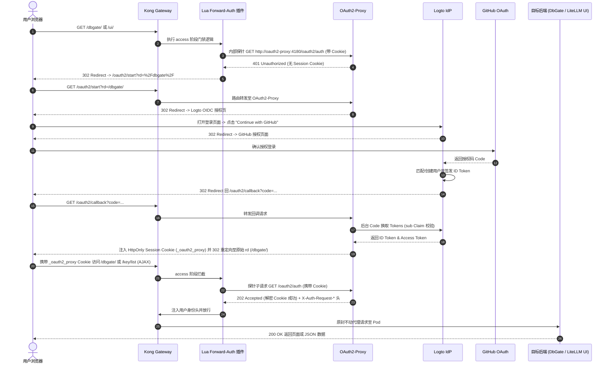

# 生产实战：基于 Kong Gateway + Logto + 自定义 Lua 插件打造零信任 GitHub SSO 统一身份网关（保护 DbGate 与 LiteLLM UI）

> **作者**：Jason (潘文林)  
> **环境背景**：Kubernetes (K3s) + Kong Ingress Controller 3.x (开源社区版) + ArgoCD GitOps  
> **核心组件**：Logto (OIDC IdP) + GitHub OAuth + OAuth2-Proxy + Kong 自定义 Forward-Auth 插件

---

## 1. 痛点与架构演进背景

在多云与混合云架构的实际运维中，我们通常会在 Kubernetes 集群内暴露若干基础服务与管理控制台：
- **DbGate**：强大的轻量级 Web 数据库管理终端，用于直连集群内及内网多节点数据库；
- **LiteLLM**：大模型统一网关，包含供管理员调试与配置的 **Web 控制台（Next.js 构建）**，以及供下游自动化脚本、Coding Agent（如 Claude / OpenCode / Cursor）高频调用的 **OpenAI 兼容推理 API (`/v1/*`)**。

### 1.1 传统方案的致命缺陷
1. **认证碎片化与账密风险**：每个控制台各自维护独立的 Basic-Auth 或硬编码账密，缺乏中央会话销毁能力与统一审计；
2. **混合流量冲突（关键痛点）**：LiteLLM 的 Web 控制台需要高强度的身份验证，但其模型推理 API 必须由外部 Agent 凭借 `Bearer sk-...` 密钥高速直连。如果直接在 Ingress 或网关层对整个服务开启全量认证拦截，所有自动化脚本和 Agent 在调用推理接口时都会收到 `302 Found` 重定向至 HTML 网页登录页，导致整个 AI 自动化调用链路瞬间瘫痪；
3. **国内巨头开放平台的资质门槛**：微信开放平台、支付宝开放平台等在 PC 网站扫码登录场景下，强制要求企业营业执照、对公账户以及打印登记表加盖公章，个人开发者与私有研发团队根本无法顺利接入；
4. **Kong 社区版的插件断层**：Nginx Ingress 常见的 `nginx.ingress.kubernetes.io/auth-url` 注解在 Kong Gateway 中完全不受支持；而 Kong 官方的 `forward-auth` 和 `openid-connect` 插件又被严格限制在 **Kong Enterprise 企业商业版**，开源社区版无法直接使用。

### 1.2 破局方案：现代零信任网关架构
为了彻底解决上述痛点，我们设计并落地了一套**纯开源、去商业版依赖、无缝契合 GitOps** 的统一身份认证体系：
- **IdP (身份源)**：引入现代开源身份平台 **Logto** 作为 OIDC 核心，对接 **GitHub OAuth** 实现极客风格的一键单点登录（SSO）；
- **鉴权中枢 (Auth Engine)**：部署 **OAuth2-Proxy** 处理标准 OIDC 授权码置换、Cookie 状态维护与解密校验；
- **网关核心 (Traffic Gateway)**：在 **Kong Gateway (开源社区版)** 中编写轻量级 **Lua Forward-Auth 插件**，通过内部子请求（Subrequest）实现高性能前置鉴权，并在 Gateway API 层面实施**数据面与管理面的精准物理分流**。

---

## 2. 总体架构拓扑与认证时序

### 2.1 系统架构拓扑图 (Mermaid)

```mermaid
flowchart TD
    subgraph Clients["客户端接入层"]
        Browser["👤 开发者浏览器 (访问 Web 控制台)"]
        Agent["🤖 AI Agent / 自动化脚本 (调用推理 API)"]
    end

    subgraph KongLayer["Kong Gateway 边缘网关 (K3s / OpenResty)"]
        Gateway["Kong Ingress Controller (DaemonSet)"]
        LuaPlugin["🔌 oauth2-forward-auth (自定义 Lua 插件)"]
        GatewayAPI["HTTPRoute 路由分流引擎"]
    end

    subgraph AuthLayer["身份与鉴权中心"]
        AuthProxy["🛡️ OAuth2-Proxy Service (Port 4180)"]
        Logto["🌐 Logto Identity Provider (OIDC / OAuth 2.0)"]
        GitHub["🐙 GitHub OAuth Platform"]
    end

    subgraph BackendServices["受护业务与后端集群"]
        DbGate["🗄️ DbGate Pod (/dbgate/*)"]
        LiteLLM_UI["📊 LiteLLM Web UI & Admin API (/ui, /key, /user...)"]
        LiteLLM_API["⚡ LiteLLM Core Inference API (/litellm/v1/*)"]
    end

    %% 浏览器 UI 流量
    Browser -->|1. 请求 Web 页面| Gateway
    Gateway -->|2. access 阶段门禁| LuaPlugin
    LuaPlugin -->|3. 子请求探针 /oauth2/auth| AuthProxy
    AuthProxy -.->|4a. 未登录 401| LuaPlugin
    LuaPlugin -.->|4b. 302 Redirect| Logto
    Logto <-->|5. OAuth 授权| GitHub
    Logto -->|6. 回调换 Token 下发 Cookie| AuthProxy
    AuthProxy -.->|7. 已登录 202 放行| LuaPlugin
    LuaPlugin --> GatewayAPI

    %% 路由分流
    GatewayAPI -->|/dbgate/*| DbGate
    GatewayAPI -->|/ui, /_next, /key...| LiteLLM_UI

    %% API 流量穿透
    Agent -->|⚡ Direct Bearer Token| Gateway
    Gateway -->|物理白名单路径 - 绕过 Lua 插件| GatewayAPI
    GatewayAPI -->|/litellm/v1/* (0ms 额外延迟)| LiteLLM_API

    classDef k8s fill:#326ce5,stroke:#fff,stroke-width:2px,color:#fff;
    classDef auth fill:#6139F6,stroke:#fff,stroke-width:2px,color:#fff;
    classDef proxy fill:#059b61,stroke:#fff,stroke-width:2px,color:#fff;
    classDef client fill:#f5f5f5,stroke:#333,stroke-width:1px,color:#333;

    class Gateway,GatewayAPI,LuaPlugin k8s;
    class Logto,GitHub auth;
    class AuthProxy proxy;
    class Browser,Agent client;
```

---

### 2.2 核心鉴权时序流程 (Mermaid Sequence)



---

## 3. 核心协议与机制深度剖析

### 3.1 OAuth 2.0 vs OIDC (AuthZ vs AuthN)
很多初学者容易将两者混为一谈：
* **OAuth 2.0 负责授权 (AuthZ - Authorization)**：“你能干什么”。类似于酒店房卡，门锁只认房卡是否拥有开门权限，并不关心持卡人是谁；
* **OIDC (OpenID Connect) 负责认证 (AuthN - Authentication)**：“你是谁”。在 OAuth 2.0 之上标准化了 JWT 格式的身份证（`id_token`），明确包含 `sub`（用户唯一标识）、`email`、`name` 等声明字段；
* **在系统中的定位**：Logto 同时充当 OAuth 2.0 授权服务器与 OIDC 身份提供商（IdP）；OAuth2-Proxy 充当 OIDC Relying Party (RP)，负责解密和验证 Logto 颁发的 `id_token`。

### 3.2 Forward-Auth (前置鉴权代理) 核心机理
Forward-Auth 是一种网关与认证服务之间的解耦协议：
1. **零业务侵入**：DbGate 和 LiteLLM 自身无需改动任何一行代码，完全不知晓 SSO 的存在；
2. **轻量探针问询 (Subrequest)**：Kong 收到外部请求后，并不直接转发给业务 Pod，而是先提取 Cookie，向内网的 `oauth2-proxy:4180/oauth2/auth` 发起微秒级子请求；
3. **决策分流**：
   - 若返回 `200/202`：放行并将解析出的用户身份（如 `X-Auth-Request-User`）注入请求头传给后端；
   - 若返回 `401/403`：拦截请求，对异步 AJAX（`Accept: application/json`）返回 401 JSON，对浏览器页面返回 302 重定向引导登录。

---

## 4. 关键避坑指南与踩坑记录

在实际集成过程中，我们遇到了几个极具隐蔽性的“深坑”，在此特别记录解决方案：

### 坑 1：社交登录无真实 Email 导致 OAuth2-Proxy 500 崩溃
* **机理**：OAuth2-Proxy 默认按标准 OIDC 协议期望从 ID Token 中提取 `email` Claim 进行身份标识。但用户通过第三方社交登录（如微信或部分未公开邮箱的 GitHub 用户）时，Logto 下发的 ID Token 默认**可能不包含 email 字段**；
* **对策**：在 `oauth2-proxy` 的配置中强制指定使用 `sub`（Logto 唯一用户 ID）作为主身份标识：
  ```bash
  --user-id-claim="sub"
  --oidc-email-claim="sub"
  --email-domain="*"
  --insecure-oidc-allow-unverified-email=true
  ```

### 坑 2：跨命名空间 (Cross-Namespace) 插件引用失效
* **机理**：我们的网关基础设施部署在 `default` 命名空间，DbGate 在 `default`，而 LiteLLM 部署在 `llm-system` 命名空间。如果在 `default` 命名空间只创建了普通的 `KongPlugin`，Kong Ingress Controller 处理 `llm-system` 下的 HTTPRoute 时会报：`no KongPlugin or KongClusterPlugin was found for llm-system/oauth2-forward-auth`；
* **对策**：必须同时声明集群作用域的 **`KongClusterPlugin`**，或在各业务命名空间内均分发同名 `KongPlugin`。

### 坑 3：Next.js SPA 应用的路由覆盖与 AJAX 白屏
* **机理**：LiteLLM 的 UI 是基于 Next.js 开发的单页应用。如果网关仅保护 `/ui` 路径，会导致静态资源（`/_next/*`）和敏感后台接口（`/key/*`、`/user/*`、`/models/*`）在公网裸露；反之如果 Session 过期时后台 AJAX 请求收到 302 HTML，前端 JSON 解析失败会导致页面白屏；
* **对策**：
  1. 将全部静态资源与敏感管理端点统一划入受保护路由组；
  2. Lua 插件中判断 `Accept: application/json` 或 `X-Requested-With: XMLHttpRequest`，命中时直接返回 HTTP 401 JSON，促使前端优雅触发刷新。

---

## 5. 核心代码与 GitOps 配置文件详解

所有配置均收拢在 GitOps 仓库 `my-argocd-manifests` 中，实现配置即代码（IaC）。

### 5.1 编写 Kong Forward-Auth Lua 插件清单
**文件路径**：`infrastructure/kong-gateway/oauth2-forward-auth-plugin.yaml`

```yaml
apiVersion: v1
kind: ConfigMap
metadata:
  name: kong-plugin-oauth2-forward-auth
  namespace: kong-system
data:
  schema.lua: |
    local typedefs = require "kong.db.schema.typedefs"

    return {
      name = "oauth2-forward-auth",
      fields = {
        { consumer = typedefs.no_consumer },
        { protocols = typedefs.protocols_http },
        { config = {
            type = "record",
            fields = {
              { auth_url = { type = "string", default = "http://oauth2-proxy.default.svc.cluster.local:4180/oauth2/auth" } },
              { signin_url = { type = "string", default = "/oauth2/start" } },
              { timeout = { type = "number", default = 3000 } },
              { keepalive_timeout = { type = "number", default = 60000 } },
            },
        }, },
      },
    }

  handler.lua: |
    local http = require "resty.http"
    local ngx = ngx
    local kong = kong

    local OAuth2ForwardAuth = {
      PRIORITY = 1001,
      VERSION = "1.0.0",
    }

    function OAuth2ForwardAuth:access(conf)
      local req_uri = ngx.var.request_uri or kong.request.get_path_with_query()
      local headers = kong.request.get_headers()

      -- 1. 组装转发给 OAuth2-Proxy 的探针请求头
      local fwd_headers = {}
      for k, v in pairs(headers) do
        local lk = k:lower()
        if lk ~= "host" and lk ~= "content-length" and lk ~= "content-type" then
          fwd_headers[k] = v
        end
      end
      fwd_headers["X-Forwarded-Uri"] = req_uri
      fwd_headers["X-Forwarded-Path"] = ngx.var.uri
      fwd_headers["X-Forwarded-Method"] = kong.request.get_method()
      fwd_headers["X-Forwarded-Host"] = kong.request.get_host()
      fwd_headers["X-Forwarded-Proto"] = kong.request.get_scheme()

      -- 2. 向集群内部 OAuth2-Proxy 发起轻量探针子请求
      local httpc = http.new()
      httpc:set_timeout(conf.timeout or 3000)

      local auth_url = conf.auth_url or "http://oauth2-proxy.default.svc.cluster.local:4180/oauth2/auth"
      local res, err = httpc:request_uri(auth_url, {
        method = "GET",
        headers = fwd_headers,
        keepalive_timeout = conf.keepalive_timeout or 60000,
        keepalive_pool = 10,
      })

      if not res then
        kong.log.err("OAuth2-Proxy connection failed: ", err)
        return kong.response.exit(502, { message = "Authentication service unreachable" })
      end

      -- 3. 校验通过 (200 OK 或 202 Accepted)
      if res.status == 200 or res.status == 202 then
        -- (a) 若 Cookie 有刷新，回写 Set-Cookie 响应头
        if res.headers["set-cookie"] then
          local set_cookie = res.headers["set-cookie"]
          if type(set_cookie) == "table" then
            for _, sc in ipairs(set_cookie) do
              kong.response.add_header("Set-Cookie", sc)
            end
          else
            kong.response.set_header("Set-Cookie", set_cookie)
          end
        end

        -- (b) 将身份声明头 (X-Auth-Request-*) 注入并透传给下游业务 Pod
        for hname, hval in pairs(res.headers) do
          if hname:lower():find("^x%-auth%-request%-") then
            kong.service.request.set_header(hname, hval)
          end
        end

        return
      end

      -- 4. 未认证拦截 (401 Unauthorized 或 403 Forbidden)
      if res.status == 401 or res.status == 403 then
        local accept = (headers["accept"] or ""):lower()
        local x_req = (headers["x-requested-with"] or ""):lower()

        -- 异步 AJAX / JSON 请求返回 401 纯 JSON，避免 SPA 页面解析 HTML 崩溃
        if accept:find("application/json") or x_req == "xmlhttprequest" then
          return kong.response.exit(401, { message = "Unauthorized: Session expired or not authenticated" })
        end

        -- 网页浏览器请求下发 302 重定向至登录入口，并附带当前原始目标地址 (rd)
        local signin_url = conf.signin_url or "/oauth2/start"
        local redirect_target = signin_url .. "?rd=" .. ngx.escape_uri(req_uri)

        return kong.response.exit(302, nil, {
          ["Location"] = redirect_target,
          ["Cache-Control"] = "no-cache, no-store, must-revalidate",
        })
      end

      return kong.response.exit(res.status, res.body)
    end

    return OAuth2ForwardAuth
---
# 集群全局插件定义 (供所有命名空间的 HTTPRoute 跨空间引用)
apiVersion: configuration.konghq.com/v1
kind: KongClusterPlugin
metadata:
  name: oauth2-forward-auth
plugin: oauth2-forward-auth
config:
  auth_url: "http://oauth2-proxy.default.svc.cluster.local:4180/oauth2/auth"
  signin_url: "/oauth2/start"
  timeout: 3000
---
# 命名空间级插件定义
apiVersion: configuration.konghq.com/v1
kind: KongPlugin
metadata:
  name: oauth2-forward-auth
  namespace: default
plugin: oauth2-forward-auth
config:
  auth_url: "http://oauth2-proxy.default.svc.cluster.local:4180/oauth2/auth"
  signin_url: "/oauth2/start"
  timeout: 3000
---
apiVersion: configuration.konghq.com/v1
kind: KongPlugin
metadata:
  name: oauth2-forward-auth
  namespace: llm-system
plugin: oauth2-forward-auth
config:
  auth_url: "http://oauth2-proxy.default.svc.cluster.local:4180/oauth2/auth"
  signin_url: "/oauth2/start"
  timeout: 3000
```

---

### 5.2 在 Kong Controller 中装配插件
**文件路径**：`argocd-apps/kong-controller-app.yaml`

```yaml
apiVersion: argoproj.io/v1alpha1
kind: Application
metadata:
  name: kong-ingress-controller
  namespace: argocd
spec:
  project: default
  source:
    repoURL: 'https://charts.konghq.com'
    chart: kong
    targetRevision: 2.38.0
    helm:
      values: |
        ingressController:
          installCRDs: false
        env:
          database: "off"
        gateway:
          enabled: true
        deployment:
          daemonset: true
        proxy:
          externalTrafficPolicy: Local
        # 🎯 将自定义 Lua 插件注册进 Kong Pod
        plugins:
          configMaps:
            - pluginName: custom-auth
              name: kong-plugin-custom-auth
            - pluginName: oauth2-forward-auth
              name: kong-plugin-oauth2-forward-auth
  destination:
    name: 'tencent-dp1-cluster'
    namespace: kong-system
```

---

### 5.3 部署 OAuth2-Proxy 服务与公开回调路由
**文件路径**：`argocd-apps/oauth2-proxy-app.yaml`

```yaml
apiVersion: argoproj.io/v1alpha1
kind: Application
metadata:
  name: oauth2-proxy
  namespace: argocd
spec:
  project: default
  source:
    repoURL: 'https://github.com/nvd11/my-shared-helm-charts.git'
    path: charts/generic-web-service
    targetRevision: 'v1.1.3'
    helm:
      values: |
        replicaCount: 1
        containerPort: 4180

        image:
          repository: quay.io/oauth2-proxy/oauth2-proxy
          tag: v7.8.1
          pullPolicy: IfNotPresent

        env:
          - name: OAUTH2_PROXY_PROVIDER
            value: "oidc"
          - name: OAUTH2_PROXY_OIDC_ISSUER_URL
            value: "https://sodaxw.logto.app/oidc"
          - name: OAUTH2_PROXY_CLIENT_ID
            value: "inck8s2812o0gzfgzqvug"
          - name: OAUTH2_PROXY_CLIENT_SECRET
            value: "ro4AzXu7jIm7H058Rd61aqmi84SwdUv3"
          - name: OAUTH2_PROXY_COOKIE_SECRET
            value: "nX6uf-XZMMELlmqXx7rV-LULdaMJTp9iXXBmNCSbmic="
          - name: OAUTH2_PROXY_HTTP_ADDRESS
            value: "0.0.0.0:4180"
          - name: OAUTH2_PROXY_UPSTREAMS
            value: "static://202"
          # 🎯 避坑关键配置：使用 sub 规避微信/GitHub 无邮箱报错
          - name: OAUTH2_PROXY_USER_ID_CLAIM
            value: "sub"
          - name: OAUTH2_PROXY_OIDC_EMAIL_CLAIM
            value: "sub"
          - name: OAUTH2_PROXY_EMAIL_DOMAINS
            value: "*"
          - name: OAUTH2_PROXY_INSECURE_OIDC_ALLOW_UNVERIFIED_EMAIL
            value: "true"
          # 🎯 安全 Cookie 与泛域名 SSO 支持
          - name: OAUTH2_PROXY_COOKIE_SECURE
            value: "true"
          - name: OAUTH2_PROXY_COOKIE_HTTPONLY
            value: "true"
          - name: OAUTH2_PROXY_COOKIE_SAMESITE
            value: "lax"
          - name: OAUTH2_PROXY_COOKIE_DOMAINS
            value: ".jppwl.asia"
          - name: OAUTH2_PROXY_COOKIE_NAME
            value: "_oauth2_proxy"
          - name: OAUTH2_PROXY_REVERSE_PROXY
            value: "true"
          - name: OAUTH2_PROXY_SET_XAUTHREQUEST
            value: "true"
          - name: OAUTH2_PROXY_PASS_ACCESS_TOKEN
            value: "true"
          - name: OAUTH2_PROXY_SET_AUTHORIZATION_HEADER
            value: "true"
          - name: OAUTH2_PROXY_SIGNOUT_URL
            value: "https://sodaxw.logto.app/oidc/session/end?post_logout_redirect_uri=https://gw.jppwl.asia/dbgate/"
          - name: OAUTH2_PROXY_REDIRECT_URL
            value: "https://gw.jppwl.asia/oauth2/callback"

        livenessProbe:
          path: /ping
          initialDelaySeconds: 10
          periodSeconds: 15

        readinessProbe:
          path: /ping
          initialDelaySeconds: 10
          periodSeconds: 15

        service:
          type: ClusterIP
          port: 4180

        nodeSelector:
          kubernetes.io/hostname: "vm-0-2-debian"

        # 🎯 开放公网 /oauth2 路径 (严禁挂载任何认证插件)
        route:
          enabled: true
          parentGateway: kong-main-gateway
          path: /oauth2

  destination:
    name: 'tencent-dp1-cluster'
    namespace: default
  syncPolicy:
    automated:
      prune: true
      selfHeal: true
    syncOptions:
      - CreateNamespace=true
```

---

### 5.4 受护服务挂载与精准分流配置

#### (1) DbGate 接入 SSO
**文件路径**：`argocd-apps/dbgate-app.yaml`

```yaml
        service:
          type: ClusterIP
          port: 80
          annotations:
            # 🎯 挂载 forward-auth 插件
            konghq.com/plugins: oauth2-forward-auth

        route:
          enabled: true
          parentGateway: kong-main-gateway
          path: /dbgate
```

#### (2) LiteLLM 流量分流保护（UI 强认证 vs API 零拦截直连）
**文件路径**：`argocd-apps/litellm-svc-app.yaml`

```yaml
        # 1. ⚡ 推理数据面 API：物理免拦截白名单 (Bearer Token 直通)
        route:
          enabled: true
          parentGateway: kong-main-gateway
          path: /litellm
          pathType: PathPrefix
          annotations:
            konghq.com/strip-path: "true"
            # 🎯 绝不挂载 oauth2 插件，仅由 LiteLLM 自身校验 sk-... 密钥

        # 2. 🛡️ 管理控制台面：强 OAuth2 登录保护
        extraRoutes:
          ui-route:
            parentGateway: kong-main-gateway
            parentGatewayNamespace: default
            annotations:
              konghq.com/plugins: oauth2-forward-auth # 🎯 挂载门禁
            rules:
              # 前端页面与静态资产
              - matches:
                  - path: /ui
                  - path: /litellm-asset-prefix
                  - path: /_next
                  - path: /fallback
                  - path: /swagger
                  - path: /favicon.ico
              # 登录与流程端点
              - matches:
                  - path: /login
                  - path: /v2
                  - path: /v3
                  - path: /auth
                  - path: /sso
              # 核心管理 API (防止外网直接探测)
              - matches:
                  - path: /key
                  - path: /user
                  - path: /team
                  - path: /models
                  - path: /spend
                  - path: /health
```

---

## 6. 全链路实战测试与边界验证

在 ArgoCD 完成自动化同步后，我们通过终端命令行进行了严苛的链路探测测试：

### 场景 1：未登录访问 Web 控制台（预期 302 拦截重定向）
```bash
$ curl -s -I https://gw.jppwl.asia/dbgate/
HTTP/2 302 
location: /oauth2/start?rd=%2Fdbgate%2F
cache-control: no-cache, no-store, must-revalidate

$ curl -s -I https://gw.jppwl.asia/ui/
HTTP/2 302 
location: /oauth2/start?rd=%2Fui%2F
cache-control: no-cache, no-store, must-revalidate
```
👉 **结论**：Kong 成功拦截未认证流量，并在毫秒级下发 302 重定向至登录流程。

---

### 场景 2：未登录调用后台管理 API（预期 401 纯 JSON，非 HTML 重定向）
```bash
$ curl -s -i -H "Accept: application/json" https://gw.jppwl.asia/key/list
HTTP/2 401 
content-type: application/json; charset=utf-8

{"message":"Unauthorized: Session expired or not authenticated"}
```
👉 **结论**：针对 AJAX 请求，Lua 插件准确识别请求头并直接返回 401 JSON，彻底杜绝单页应用解析 HTML 导致的白屏异常。

---

### 场景 3：外部 Agent 调用大模型推理 API（预期 100% 直连透传，0 拦截）
```bash
$ curl -s -X GET https://gw.jppwl.asia/litellm/v1/models
{
  "error": {
    "code": "401",
    "message": "Authentication Error, No api key passed in.",
    "param": "None",
    "type": "auth_error"
  }
}
```
👉 **结论**：请求直接穿透网关到达 LiteLLM Pod，由 LiteLLM 自身校验 `Bearer sk-...` 密钥，**完全绕过 OAuth2-Proxy，额外延迟为 0ms**！

---

## 7. 权限管控：Logto 应用级访问控制 (RBAC)

为了避免在 Kubernetes 网关层硬编码白名单的死板，我们将细粒度权限管控收拢在 **Logto 身份中心**：

```
                               [ 用户 GitHub 登录通过 ]
                                          │
                                          ▼
                   ┌──────────────────────────────────────────────┐
                   │    Logto 访问控制决策 (App-Level Access)     │
                   │                                              │
                   │  • 是否在应用授权名单中？                     │
                   │  • 是否拥有目标 App 的 RBAC 角色？            │
                   └──────────────┬────────────────┬──────────────┘
                                  │                │
                        [ 授权用户 (nvd11) ]   [ 未授权用户 ]
                                  │                │
                                  ▼                ▼
                          [ 放行进入控制台 ]   [ 403 Access Denied ]
```

1. **源头防盗锁（关闭自由注册）**：
   在 Logto 中将 `signInMode` 设置为 `SignIn`（只允许登录，关闭注册）。陌生人即使使用自己的 GitHub 账号点击授权，也会被 Logto 直接拦截：“该系统未开放公开注册”；
2. **应用级准入（App-Level Access Control）**：
   在 Logto 控制台中针对每个应用开启准入开关，可以为不同成员分配不同权限：
   - 管理员账号（`nvd11`）：拥有 DbGate + LiteLLM 完整访问权；
   - 团队普通成员：仅分配 LiteLLM UI 权限，点进 DbGate 直接被拒；
3. **免发布即时生效**：
   所有权限变更均在 Logto 可视化界面点选完成，**无需修改任何 K8s 配置文件或重启服务**，即改即生效。

---

## 8. 总结与架构收益

通过这套 **Kong Gateway (KIC) + Logto + GitHub OAuth + OAuth2-Proxy** 的架构落地，我们实现了：
1. **纯开源、零商业版依赖**：用轻量 Lua 脚本在开源 Kong 社区版上实现了媲美 Enterprise 的 Forward-Auth 门禁能力；
2. **完美解决混合流量冲突**：管理面（Web UI）强认证、数据面（LLM 推理 API）零损耗直连穿透；
3. **极客级登录体验**：告别国内繁琐复杂的企业资质盖章，拥抱安全、丝滑的 GitHub 一键单点登录；
4. **纯粹的 GitOps 声明式管理**：全量资源声明托管于 ArgoCD，实现可复现、版本化的一键式分发交付。
