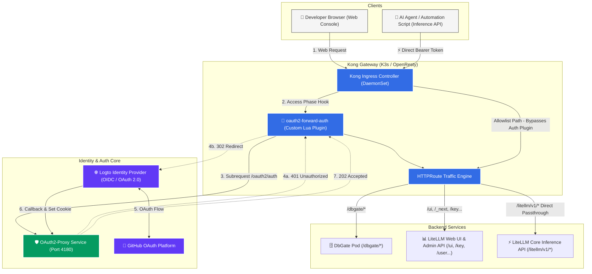
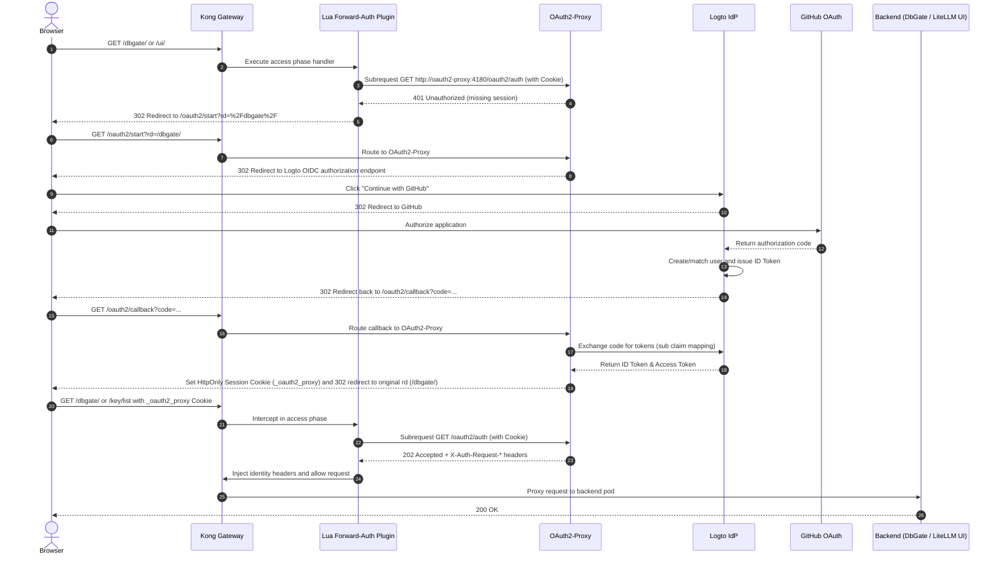

# Production Guide: Zero-Trust GitHub SSO with Kong Gateway, Logto, and Custom Lua Forward-Auth (Securing DbGate and LiteLLM UI)

> **Author**: Jason (Wenlin Pan)  
> **Environment**: Kubernetes (K3s) + Kong Ingress Controller 3.x (OSS Community Edition) + ArgoCD GitOps  
> **Core Stack**: Logto (OIDC IdP) + GitHub OAuth + OAuth2-Proxy + Kong Custom Forward-Auth Plugin  

---

## 1. Context and Problem Statement

When exposing internal dashboards and services in a Kubernetes cluster, you frequently encounter two main types of workloads:
- **DbGate**: A lightweight web database administration client used to connect directly to internal cluster databases.
- **LiteLLM**: A unified model gateway containing both a **Next.js Web UI** for administrative management and a high-throughput **OpenAI-compatible inference API (`/v1/*`)** called by external automated scripts and coding agents (Claude, OpenCode, Cursor).

### 1.1 Limitations of Traditional Setups
1. **Fragmented credentials and audit gaps**: Maintaining independent Basic-Auth or static credentials across services makes centralized session revocation and access auditing difficult.
2. **Mixed traffic conflicts**: The LiteLLM management UI needs strong authentication, but its model inference endpoints must accept direct `Bearer sk-...` tokens with zero redirection. Applying gateway-wide authentication blocks API traffic by returning `302 Found` HTML redirects to automated agents.
3. **Enterprise qualification barriers in local platforms**: Domestic platforms like WeChat Open Platform or Alipay require formal corporate licenses, corporate bank verification, and notarized paperwork for web QR login, making them impractical for private setups and solo developer environments.
4. **Plugin limitations in Kong OSS**: Kong OSS does not recognize the standard Nginx annotation `nginx.ingress.kubernetes.io/auth-url`. Official `forward-auth` and `openid-connect` plugins are restricted to **Kong Enterprise**, leaving OSS users with no turnkey SSO integration.

### 1.2 The Solution Architecture
To address these challenges without enterprise licensing, we built a zero-trust authentication setup using open-source tools and GitOps:
- **Identity Provider (IdP)**: **Logto** serves as the OIDC identity foundation, backed by **GitHub OAuth** for seamless single sign-on.
- **Authentication Engine**: **OAuth2-Proxy** manages OIDC token exchange, encrypted session cookies, and allowlist verification.
- **Traffic Gateway**: **Kong Gateway (OSS)** runs a custom **Lua Forward-Auth plugin** that executes subrequests against OAuth2-Proxy, while Gateway API HTTPRoutes enforce a clean **separation between administrative UI traffic and automated API traffic**.

---

## 2. Architecture and Authentication Flow

### 2.1 System Architecture Topology



---

### 2.2 End-to-End Sequence Flow



---

## 3. Key Concepts and Mechanics

### 3.1 OAuth 2.0 vs OIDC (AuthZ vs AuthN)
* **OAuth 2.0 handles Authorization (AuthZ)** ("What can you access?"): Functions like a hotel keycard. The door reader checks if the card is valid for that room without caring about the guest's personal identity.
* **OIDC (OpenID Connect) handles Authentication (AuthN)** ("Who are you?"): Extends OAuth 2.0 by providing a standard JWT identity card (`id_token`) containing claims like `sub` (unique subject ID), `email`, and `name`.
* **Roles in this system**: Logto acts as both the OAuth 2.0 authorization server and OIDC Identity Provider. OAuth2-Proxy operates as the OIDC Relying Party (RP) that verifies tokens signed by Logto.

### 3.2 Forward-Auth Subrequest Pattern
Forward-Auth decouples authentication from the backend services:
1. **Zero backend code changes**: Neither DbGate nor LiteLLM needs any code changes or awareness of OIDC/SSO.
2. **Low-overhead subrequests**: Kong intercepts inbound requests, extracts headers and cookies, and queries `oauth2-proxy:4180/oauth2/auth` over the internal network.
3. **Smart branching**:
   - On `200/202`: Kong forwards the original request to the backend along with identity headers (e.g., `X-Auth-Request-User`).
   - On `401/403`: Kong intercepts the request. For AJAX calls (`Accept: application/json`), it returns a 401 JSON error; for browser requests, it issues a 302 redirect to the login endpoint.

---

## 4. Key Pitfalls and Solutions

### Pitfall 1: Missing Email Claim in Social Logins
* **Problem**: OAuth2-Proxy defaults to looking for an `email` claim in the ID Token. When users log in via social providers (such as GitHub accounts with private emails or WeChat), Logto's ID Token may lack an email attribute, causing OAuth2-Proxy to return `Error: user email not found in id_token`.
* **Solution**: Configure OAuth2-Proxy to use `sub` (the immutable Logto user ID) as the primary identity identifier:
  ```bash
  --user-id-claim="sub"
  --oidc-email-claim="sub"
  --email-domain="*"
  --insecure-oidc-allow-unverified-email=true
  ```

### Pitfall 2: Cross-Namespace KongPlugin Lookup Failures
* **Problem**: The gateway infrastructure runs in the `default` namespace, DbGate is in `default`, and LiteLLM runs in `llm-system`. Creating a standard `KongPlugin` in `default` causes the Kong Ingress Controller to fail when reconciling routes in `llm-system` with: `no KongPlugin or KongClusterPlugin was found for llm-system/oauth2-forward-auth`.
* **Solution**: Define a cluster-scoped **`KongClusterPlugin`**, or create a matching `KongPlugin` inside each target namespace.

### Pitfall 3: Next.js Single Page App Route Coverage and AJAX Errors
* **Problem**: LiteLLM's UI is a Next.js single page application. If the gateway only protects `/ui`, static assets (`/_next/*`) and backend APIs (`/key/*`, `/user/*`, `/models/*`) remain exposed. Furthermore, if background AJAX requests receive a 302 HTML response when a session expires, JSON parsing fails on the client, resulting in a blank page.
* **Solution**:
  1. Protect both static assets and management endpoints under the authenticated route rule.
  2. Inspect `Accept: application/json` or `X-Requested-With: XMLHttpRequest` headers in the Lua plugin to immediately return HTTP 401 JSON for API calls instead of a redirect.

---

## 5. Manifests and GitOps Configuration

All resources are versioned in `my-argocd-manifests`.

### 5.1 Kong Lua Forward-Auth Plugin Manifest
**File**: `infrastructure/kong-gateway/oauth2-forward-auth-plugin.yaml`

```yaml
apiVersion: v1
kind: ConfigMap
metadata:
  name: kong-plugin-oauth2-forward-auth
  namespace: kong-system
data:
  schema.lua: |
    local typedefs = require "kong.db.schema.typedefs"

    return {
      name = "oauth2-forward-auth",
      fields = {
        { consumer = typedefs.no_consumer },
        { protocols = typedefs.protocols_http },
        { config = {
            type = "record",
            fields = {
              { auth_url = { type = "string", default = "http://oauth2-proxy.default.svc.cluster.local:4180/oauth2/auth" } },
              { signin_url = { type = "string", default = "/oauth2/start" } },
              { timeout = { type = "number", default = 3000 } },
              { keepalive_timeout = { type = "number", default = 60000 } },
            },
        }, },
      },
    }

  handler.lua: |
    local http = require "resty.http"
    local ngx = ngx
    local kong = kong

    local OAuth2ForwardAuth = {
      PRIORITY = 1001,
      VERSION = "1.0.0",
    }

    function OAuth2ForwardAuth:access(conf)
      local req_uri = ngx.var.request_uri or kong.request.get_path_with_query()
      local headers = kong.request.get_headers()

      -- 1. Build subrequest headers for OAuth2-Proxy
      local fwd_headers = {}
      for k, v in pairs(headers) do
        local lk = k:lower()
        if lk ~= "host" and lk ~= "content-length" and lk ~= "content-type" then
          fwd_headers[k] = v
        end
      end
      fwd_headers["X-Forwarded-Uri"] = req_uri
      fwd_headers["X-Forwarded-Path"] = ngx.var.uri
      fwd_headers["X-Forwarded-Method"] = kong.request.get_method()
      fwd_headers["X-Forwarded-Host"] = kong.request.get_host()
      fwd_headers["X-Forwarded-Proto"] = kong.request.get_scheme()

      -- 2. Send probe subrequest to OAuth2-Proxy
      local httpc = http.new()
      httpc:set_timeout(conf.timeout or 3000)

      local auth_url = conf.auth_url or "http://oauth2-proxy.default.svc.cluster.local:4180/oauth2/auth"
      local res, err = httpc:request_uri(auth_url, {
        method = "GET",
        headers = fwd_headers,
        keepalive_timeout = conf.keepalive_timeout or 60000,
        keepalive_pool = 10,
      })

      if not res then
        kong.log.err("OAuth2-Proxy connection failed: ", err)
        return kong.response.exit(502, { message = "Authentication service unreachable" })
      end

      -- 3. Authenticated (200 OK or 202 Accepted)
      if res.status == 200 or res.status == 202 then
        if res.headers["set-cookie"] then
          local set_cookie = res.headers["set-cookie"]
          if type(set_cookie) == "table" then
            for _, sc in ipairs(set_cookie) do
              kong.response.add_header("Set-Cookie", sc)
            end
          else
            kong.response.set_header("Set-Cookie", set_cookie)
          end
        end

        for hname, hval in pairs(res.headers) do
          if hname:lower():find("^x%-auth%-request%-") then
            kong.service.request.set_header(hname, hval)
          end
        end

        return
      end

      -- 4. Unauthenticated (401 Unauthorized or 403 Forbidden)
      if res.status == 401 or res.status == 403 then
        local accept = (headers["accept"] or ""):lower()
        local x_req = (headers["x-requested-with"] or ""):lower()

        -- Return 401 JSON for AJAX requests
        if accept:find("application/json") or x_req == "xmlhttprequest" then
          return kong.response.exit(401, { message = "Unauthorized: Session expired or not authenticated" })
        end

        -- Return 302 redirect for browser requests with return URL (rd)
        local signin_url = conf.signin_url or "/oauth2/start"
        local redirect_target = signin_url .. "?rd=" .. ngx.escape_uri(req_uri)

        return kong.response.exit(302, nil, {
          ["Location"] = redirect_target,
          ["Cache-Control"] = "no-cache, no-store, must-revalidate",
        })
      end

      return kong.response.exit(res.status, res.body)
    end

    return OAuth2ForwardAuth
---
# Cluster-wide plugin definition (usable across namespaces)
apiVersion: configuration.konghq.com/v1
kind: KongClusterPlugin
metadata:
  name: oauth2-forward-auth
plugin: oauth2-forward-auth
config:
  auth_url: "http://oauth2-proxy.default.svc.cluster.local:4180/oauth2/auth"
  signin_url: "/oauth2/start"
  timeout: 3000
---
# Namespace-scoped plugin definition
apiVersion: configuration.konghq.com/v1
kind: KongPlugin
metadata:
  name: oauth2-forward-auth
  namespace: default
plugin: oauth2-forward-auth
config:
  auth_url: "http://oauth2-proxy.default.svc.cluster.local:4180/oauth2/auth"
  signin_url: "/oauth2/start"
  timeout: 3000
---
apiVersion: configuration.konghq.com/v1
kind: KongPlugin
metadata:
  name: oauth2-forward-auth
  namespace: llm-system
plugin: oauth2-forward-auth
config:
  auth_url: "http://oauth2-proxy.default.svc.cluster.local:4180/oauth2/auth"
  signin_url: "/oauth2/start"
  timeout: 3000
```

---

### 5.2 Loading Plugins into Kong Ingress Controller
**File**: `argocd-apps/kong-controller-app.yaml`

```yaml
apiVersion: argoproj.io/v1alpha1
kind: Application
metadata:
  name: kong-ingress-controller
  namespace: argocd
spec:
  project: default
  source:
    repoURL: 'https://charts.konghq.com'
    chart: kong
    targetRevision: 2.38.0
    helm:
      values: |
        ingressController:
          installCRDs: false
        env:
          database: "off"
        gateway:
          enabled: true
        deployment:
          daemonset: true
        proxy:
          externalTrafficPolicy: Local
        # Mount custom Lua plugins into the Kong Pods
        plugins:
          configMaps:
            - pluginName: custom-auth
              name: kong-plugin-custom-auth
            - pluginName: oauth2-forward-auth
              name: kong-plugin-oauth2-forward-auth
  destination:
    name: 'tencent-dp1-cluster'
    namespace: kong-system
```

---

### 5.3 OAuth2-Proxy Application Manifest
**File**: `argocd-apps/oauth2-proxy-app.yaml`

```yaml
apiVersion: argoproj.io/v1alpha1
kind: Application
metadata:
  name: oauth2-proxy
  namespace: argocd
spec:
  project: default
  source:
    repoURL: 'https://github.com/nvd11/my-shared-helm-charts.git'
    path: charts/generic-web-service
    targetRevision: 'v1.1.3'
    helm:
      values: |
        replicaCount: 1
        containerPort: 4180

        image:
          repository: quay.io/oauth2-proxy/oauth2-proxy
          tag: v7.8.1
          pullPolicy: IfNotPresent

        env:
          - name: OAUTH2_PROXY_PROVIDER
            value: "oidc"
          - name: OAUTH2_PROXY_OIDC_ISSUER_URL
            value: "https://sodaxw.logto.app/oidc"
          - name: OAUTH2_PROXY_CLIENT_ID
            value: "inck8s2812o0gzfgzqvug"
          - name: OAUTH2_PROXY_CLIENT_SECRET
            value: "ro4AzXu7jIm7H058Rd61aqmi84SwdUv3"
          - name: OAUTH2_PROXY_COOKIE_SECRET
            value: "nX6uf-XZMMELlmqXx7rV-LULdaMJTp9iXXBmNCSbmic="
          - name: OAUTH2_PROXY_HTTP_ADDRESS
            value: "0.0.0.0:4180"
          - name: OAUTH2_PROXY_UPSTREAMS
            value: "static://202"
          # Critical: Use sub claim to avoid errors with social logins lacking email
          - name: OAUTH2_PROXY_USER_ID_CLAIM
            value: "sub"
          - name: OAUTH2_PROXY_OIDC_EMAIL_CLAIM
            value: "sub"
          - name: OAUTH2_PROXY_EMAIL_DOMAINS
            value: "*"
          - name: OAUTH2_PROXY_INSECURE_OIDC_ALLOW_UNVERIFIED_EMAIL
            value: "true"
          # Cookie and cross-domain SSO settings
          - name: OAUTH2_PROXY_COOKIE_SECURE
            value: "true"
          - name: OAUTH2_PROXY_COOKIE_HTTPONLY
            value: "true"
          - name: OAUTH2_PROXY_COOKIE_SAMESITE
            value: "lax"
          - name: OAUTH2_PROXY_COOKIE_DOMAINS
            value: ".jppwl.asia"
          - name: OAUTH2_PROXY_COOKIE_NAME
            value: "_oauth2_proxy"
          - name: OAUTH2_PROXY_REVERSE_PROXY
            value: "true"
          - name: OAUTH2_PROXY_SET_XAUTHREQUEST
            value: "true"
          - name: OAUTH2_PROXY_PASS_ACCESS_TOKEN
            value: "true"
          - name: OAUTH2_PROXY_SET_AUTHORIZATION_HEADER
            value: "true"
          - name: OAUTH2_PROXY_SIGNOUT_URL
            value: "https://sodaxw.logto.app/oidc/session/end?post_logout_redirect_uri=https://gw.jppwl.asia/dbgate/"
          - name: OAUTH2_PROXY_REDIRECT_URL
            value: "https://gw.jppwl.asia/oauth2/callback"

        livenessProbe:
          path: /ping
          initialDelaySeconds: 10
          periodSeconds: 15

        readinessProbe:
          path: /ping
          initialDelaySeconds: 10
          periodSeconds: 15

        service:
          type: ClusterIP
          port: 4180

        nodeSelector:
          kubernetes.io/hostname: "vm-0-2-debian"

        # Public endpoint for OAuth2 flow (no auth plugin attached)
        route:
          enabled: true
          parentGateway: kong-main-gateway
          path: /oauth2

  destination:
    name: 'tencent-dp1-cluster'
    namespace: default
  syncPolicy:
    automated:
      prune: true
      selfHeal: true
    syncOptions:
      - CreateNamespace=true
```

---

### 5.4 Protecting Backend Services and Traffic Splitting

#### (1) DbGate
**File**: `argocd-apps/dbgate-app.yaml`

```yaml
        service:
          type: ClusterIP
          port: 80
          annotations:
            # Attach forward-auth plugin
            konghq.com/plugins: oauth2-forward-auth

        route:
          enabled: true
          parentGateway: kong-main-gateway
          path: /dbgate
```

#### (2) LiteLLM Traffic Splitting (UI Auth vs API Direct Access)
**File**: `argocd-apps/litellm-svc-app.yaml`

```yaml
        # 1. Direct inference data plane API (Bearer token passthrough)
        route:
          enabled: true
          parentGateway: kong-main-gateway
          path: /litellm
          pathType: PathPrefix
          annotations:
            konghq.com/strip-path: "true"
            # Never attach oauth2 plugins here; LiteLLM validates keys directly

        # 2. Administrative console plane (Enforced OAuth2 login)
        extraRoutes:
          ui-route:
            parentGateway: kong-main-gateway
            parentGatewayNamespace: default
            annotations:
              konghq.com/plugins: oauth2-forward-auth
            rules:
              # Static assets and frontend pages
              - matches:
                  - path: /ui
                  - path: /litellm-asset-prefix
                  - path: /_next
                  - path: /fallback
                  - path: /swagger
                  - path: /favicon.ico
              # Auth and login endpoints
              - matches:
                  - path: /login
                  - path: /v2
                  - path: /v3
                  - path: /auth
                  - path: /sso
              # Admin APIs
              - matches:
                  - path: /key
                  - path: /user
                  - path: /team
                  - path: /models
                  - path: /spend
                  - path: /health
```

---

## 6. Verification and Test Results

After ArgoCD reconciled the configurations, we verified each route pattern:

### Scenario 1: Unauthenticated Web Access (Expects 302 Redirect)
```bash
$ curl -s -I https://gw.jppwl.asia/dbgate/
HTTP/2 302 
location: /oauth2/start?rd=%2Fdbgate%2F
cache-control: no-cache, no-store, must-revalidate

$ curl -s -I https://gw.jppwl.asia/ui/
HTTP/2 302 
location: /oauth2/start?rd=%2Fui%2F
cache-control: no-cache, no-store, must-revalidate
```
Kong catches unauthenticated requests and returns a `302 Found` directing the client to the login flow.

---

### Scenario 2: Unauthenticated Admin API Call (Expects 401 JSON)
```bash
$ curl -s -i -H "Accept: application/json" https://gw.jppwl.asia/key/list
HTTP/2 401 
content-type: application/json; charset=utf-8

{"message":"Unauthorized: Session expired or not authenticated"}
```
For JSON and AJAX requests, the Lua plugin returns a clean HTTP 401 JSON response instead of HTML, allowing client-side applications to handle token expiration properly.

---

### Scenario 3: Automated Agent Calling LLM Inference API (Expects Passthrough)
```bash
$ curl -s -X GET https://gw.jppwl.asia/litellm/v1/models
{
  "error": {
    "code": "401",
    "message": "Authentication Error, No api key passed in.",
    "param": "None",
    "type": "auth_error"
  }
}
```
The request passes through Kong directly to LiteLLM without hitting OAuth2-Proxy, letting LiteLLM validate the `Bearer sk-...` token with zero redirection or latency overhead.

---

## 7. Access Control: Logto Application-Level RBAC

To avoid hardcoding user allowlists in Kubernetes configuration files, access policies are managed in **Logto**:

```
                               [ User logs in via GitHub ]
                                          │
                                          ▼
                   ┌──────────────────────────────────────────────┐
                   │        Logto App-Level Access Decision       │
                   │                                              │
                   │  • Is user assigned to application?          │
                   │  • Does user hold the required RBAC role?    │
                   └──────────────┬────────────────┬──────────────┘
                                  │                │
                         [ Allowed (nvd11) ]   [ Denied User ]
                                  │                │
                                  ▼                ▼
                          [ Console Access ]   [ 403 Forbidden ]
```

1. **Disable Public Registration**:
   Set `signInMode` to `SignIn` in Logto. Uninvited users authenticating with GitHub are blocked with an unauthorized registration message.
2. **Per-Application Access Control**:
   Assign roles within the Logto admin console:
   - Admin account (`nvd11`): Full access to both DbGate and LiteLLM consoles.
   - Other users: Granted specific roles (e.g., LiteLLM UI access only).
3. **Instant Propagation**:
   Role and permission changes made in Logto take effect immediately without modifying Kubernetes manifests or restarting pods.

---

## 8. Summary

This deployment pattern provides several operational benefits:
1. **Fully open source**: Achieves enterprise-grade forward-auth gatekeeping on Kong OSS using a lightweight Lua plugin.
2. **Clean traffic separation**: Full authentication on the management plane with zero-overhead direct passthrough for AI model inference APIs.
3. **Streamlined developer login**: Avoids enterprise licensing overhead by using GitHub OAuth.
4. **GitOps managed**: All configurations and routing rules are declared in Git and synchronized through ArgoCD.
