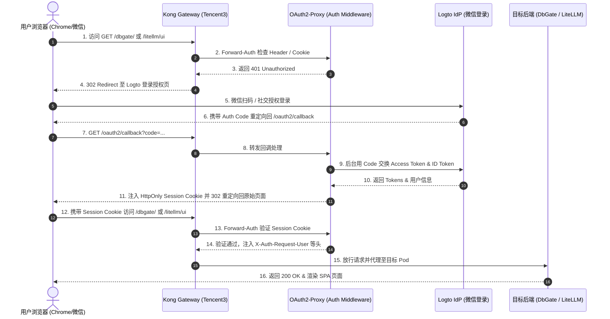

# 技术方案与实施计划：Kong Gateway 集成 Logto OAuth2 + 微信登录统一安全访问控制 (SSO)

- **文档版本**：v1.0.0
- **创建时间**：2026-08-31
- **适用节点**：Tencent3 (腾讯云 K3s / Kong Gateway 节点)
- **目标受护服务**：DbGate 控制台、LiteLLM UI (Web 管理端) 及 LiteLLM API (透传)
- **交付仓库**：`https://github.com/nvd11/my-argocd-manifests`

---

## 1. 方案背景与架构目标

### 1.1 现状与痛点
1. **认证碎片化与安全风险**：目前集群内暴露的控制台服务（如 DbGate、LiteLLM Web UI）依赖各自内置账密或轻量 Basic-Auth，缺乏统一的身份管理源（IdP）和会话撤销能力。
2. **移动端与微信登录体验诉求**：日常运维与模型管理需要便捷的单点登录（SSO）体验，期望支持微信扫码直接登录，免去频繁输入复杂账密的痛点。
3. **混合流量冲突风险**：LiteLLM 既承载供管理员配置的 Web UI，又承载供外部 Agent、脚本或应用通过 `Bearer sk-...` 调用的 LLM API。若直接对整个 Service 开启全量 OAuth2 拦截，会导致所有 API 客户端发生 `302 Found` 重定向而异常瘫痪。

### 1.2 架构设计目标
1. **统一单点登录 (SSO)**：以 Logto 作为集群核心 OIDC Identity Provider (IdP)，集成微信（WeChat）连接器，统一纳管用户身份。
2. **流量精准分流与零信任防护**：
   - **浏览器/管理流量 (Web UI)**：强制通过 Logto OAuth2 / 微信扫码认证，下发安全加密 Cookie。
   - **自动化/Agent 流量 (API)**：携带有效 `Bearer sk-...` Token 时直接穿透放行，免除 OAuth2 拦截。
3. **纯声明式 GitOps 交付**：所有 Kubernetes 资源、Kong Ingress/HTTPRoute、OAuth2-Proxy 配置均由 ArgoCD 托管，实现配置即代码（IaC）与免手工构建。

---

## 2. 总体技术架构与流量拓扑

### 2.1 架构拓扑图

```
                         ┌──────────────────────────────────────────────┐
                         │              Logto 身份认证中心               │
                         │    (OIDC IdP + 微信开放平台/公众平台连接器)       │
                         └──────────────────────▲───────────────────────┘
                                                │ OIDC Auth / Token / UserInfo
                                                ▼
[ 用户浏览器 / 微信扫码 ] ──► [ Kong Gateway (Tencent3 Node) ]
                                    │
                                    ├── (未认证请求: 302 重定向) ──► Logto 登录页
                                    ├── (鉴权验证 / Forward-Auth) ──► OAuth2-Proxy
                                    │
                                    ▼ (鉴权通过 / 带 Session Cookie)
                     ┌──────────────┴──────────────────────────┐
                     │                                         │
                     ▼                                         ▼
           [ DbGate Service ]                        [ LiteLLM Service ]
          (/dbgate/ SPA 管理端)                      ├── /ui, / (Web 控制台) [OAuth2 保护]
                                                     └── /v1/* (OpenAI 兼容 API) [Bearer 放行]
```

### 2.2 核心鉴权时序流程 (Mermaid)



---

## 3. 核心技术选型与组件职责

| 组件名称 | 选型与版本 | 核心职责 |
| :--- | :--- | :--- |
| **IdP (身份源)** | Logto (Cloud / 自建) | 提供 OIDC/OAuth2 标准协议端点、微信连接器、RBAC 角色权限与用户管理。 |
| **Auth 代理/中间件** | OAuth2-Proxy v7.x | 充当 OIDC Relying Party (RP)，负责处理 OAuth2 回调、颁发加密 Session Cookie 及验证请求。 |
| **API 网关** | Kong Gateway 3.x (KIC) | 边缘统一入口，负责 TLS 终止、路由匹配、前置鉴权插件调用及 API/UI 流量分离。 |
| **受护应用 1** | DbGate | Web 数据库管理客户端，运行于 K8s 集群内，挂载持久化存储。 |
| **受护应用 2** | LiteLLM | 大模型聚合网关，拆分 UI 控制台（需 Auth）与 API 接口（Bearer Token 透传）。 |
| **GitOps 引擎** | ArgoCD | 声明式同步所有部署清单至 `tencent-dp1-cluster` (Tencent3) 节点。 |

---

## 4. 详细实施规划与步骤分解

```
┌─────────────────────────────────────────────────────────────────────────────┐
│                            实施路线五阶段 (Roadmap)                          │
├─────────────┬─────────────┬─────────────┬─────────────┬─────────────────────┤
│   阶段一    │   阶段二    │   阶段三    │   阶段四    │       阶段五        │
│ Logto 微信  │ OAuth2-Proxy│ Kong 路由与 │ DbGate &    │ SPA 兼容性 /        │
│ 连接器配置  │ GitOps 部署 │ Forward-Auth│ LiteLLM 接入│ 边界验证与全量上线  │
└─────────────┴─────────────┴─────────────┴─────────────┴─────────────────────┘
```

### 阶段一：Logto 身份源与微信连接器配置
1. **微信开放平台配置**：
   - 在【微信开放平台】创建“网站应用”，获取 `AppID` 和 `AppSecret`。
   - 配置授权回调域名为集群公网解析域名。
2. **Logto 应用创建**：
   - 在 Logto 控制台新建 `Traditional Web App`（类型为 OIDC Client）。
   - 记录 `App ID`、`App Secret` 及 Discovery Endpoint (`https://<your-logto-domain>/oidc`)。
   - 配置 Redirect URI：`https://<ingress-domain>/oauth2/callback`。
   - 配置 Post Sign-out Redirect URI：`https://<ingress-domain>/`。
3. **微信 Connector 激活**：
   - 在 Logto “Connectors -> Social Connectors” 中启用 `WeChat Web`，填入微信 AppID 与 AppSecret。

### 阶段二：OAuth2-Proxy 部署与 Secret 安全配置
1. **创建 OAuth2-Proxy 清单**：
   - 路径：`applications/auth/oauth2-proxy/`
   - 配置提供方为 `oidc`，指定 Logto 的 OIDC Provider URL。
   - 设置 Cookie 参数：
     - `cookie_secure=true`
     - `cookie_httponly=true`
     - `cookie_samesite=lax`
     - `cookie_domains=.jppwl.asia` (支持跨子域 SSO)
2. **Secret 管理**：
   - 生成 32 字节随机 Cookie Secret (`openssl rand -base64 32 | tr -- '+/' '-_'`)。
   - 将 `client-id`、`client-secret` 与 `cookie-secret` 托管为 Kubernetes Secret。

### 阶段三：Kong Gateway Ingress & Forward-Auth 规则挂载
1. **方式 A：通过 Ingress `external-auth` 注解 (推荐)**：
   - 在 Kong Ingress 上配置 `konghq.com/plugins` 或通过 Nginx External Auth 指向 `oauth2-proxy.auth.svc.cluster.local:4180`。
2. **方式 B：Kong 自定义 Forward-Auth 插件 / HTTPRoute 过滤器**：
   - 利用 Kong `pre-function` 或专用认证插件，拦截未携带 `_oauth2_proxy` Cookie 的 HTTP 请求并跳转 `/oauth2/sign_in`。
3. **OAuth2 回调路由放行**：
   - 配置 `/oauth2/` 路径直接路由到 `oauth2-proxy` 服务，不施加任何拦截。

### 阶段四：受护服务精细化路由与 API 白名单策略

#### 4.1 DbGate 路由配置
- **路径匹配**：`/dbgate/`
- **策略**：全量开启 OAuth2 鉴权拦截。
- **环境要求**：DbGate 环境变量设置 `WEB_ROOT=/dbgate`。

#### 4.2 LiteLLM 路由分流与白名单策略（关键避坑设计）

LiteLLM 必须采用 **路径/Header 双重分流策略**：

```yaml
# 1. Web UI 路由（受保护）
apiVersion: gateway.networking.k8s.io/v1
kind: HTTPRoute
metadata:
  name: litellm-ui-route
  namespace: default
spec:
  parentRefs:
    - name: kong-main-gateway
  rules:
    - matches:
        - path:
            type: PathPrefix
            value: /ui
        - path:
            type: Exact
            value: /
      # 挂载 OAuth2-Proxy Forward-Auth 插件
      filters:
        - type: ExtensionRef
          extensionRef:
            group: configuration.konghq.com
            kind: KongPlugin
            name: oauth2-forward-auth
      backendRefs:
        - name: litellm-svc
          port: 4000

---
# 2. API 路由（免 OAuth2 拦截，放行 Bearer Token）
apiVersion: gateway.networking.k8s.io/v1
kind: HTTPRoute
metadata:
  name: litellm-api-route
  namespace: default
spec:
  parentRefs:
    - name: kong-main-gateway
  rules:
    - matches:
        - path:
            type: PathPrefix
            value: /v1/
        - path:
            type: PathPrefix
            value: /health
      # 无需 OAuth2 插件，由 LiteLLM 自身校验 sk-... Key
      backendRefs:
        - name: litellm-svc
          port: 4000
```

#### 4.3 微信用户访问控制与白名单准入策略 (RBAC & User Whitelisting)

为了防止任意微信用户扫码即可登入私有管理控制台，必须实施 **“双重锁门机制”**，精准只允许指定少数微信号访问：

```
                    [ 微信扫码发起登录 ]
                             │
                             ▼
              ┌──────────────────────────────┐
              │ 【第一道防线】：Logto 注册控制  │
              │  • 关闭公网自由注册 (Sign-up) │
              │  • 仅允许预设管理员/绑定用户  │
              └──────────────┬───────────────┘
                             │ (通过 IdP 认证)
                             ▼
              ┌──────────────────────────────┐
              │ 【第二道防线】：OAuth2-Proxy  │
              │  • authenticated_users 白名单 │
              │  • 非白名单用户 -> 403 拦截   │
              └──────────────┬───────────────┘
                             │ (命中允许列表)
                             ▼
                 [ 放行访问 DbGate / LiteLLM ]
```

1. **第一道防线：Logto IdP 端关闭公共注册 (Sign-up Protection)**
   - 在 Logto 控制台 `Sign-in Experience -> Sign-up` 设置中，**关闭陌生人自动注册 (Disable Public Sign-up)**。
   - 首次上线由管理员（主人）在 Logto 后台创建对应用户（或在首次授权窗口完成后立即锁闭注册通道），杜绝任何外部未授权微信扫码自动建号。
2. **第二道防线：OAuth2-Proxy 端声明精确用户白名单 (Zero Trust Whitelist)**
   - 在 `oauth2-proxy` 的配置清单中，通过 `authenticated_users` 或 `allowed_groups` 严格指定允许通过的 Logto 用户标识（User ID / OpenID）：
   ```ini
   # oauth2-proxy.cfg
   # 🎯 仅允许少数授权的微信号/用户 ID 登录
   authenticated_users = [
     "user_jason_master_id",     # 主人微信账号对应 ID
     "user_renee_admin_id",      # 授权家庭/团队成员 ID
   ]
   ```
   - 任何未在白名单中的微信账号，即使通过了 Logto 登录流程，在经过 OAuth2-Proxy 网关层时也会被立即拦截并返回 `403 Forbidden`，无法触碰任何后端服务。

### 阶段五：SPA 兼容性、WebSocket 穿透与全链路联调
1. **DbGate SPA 接口校验**：
   - 验证 DbGate 加载后发起的后台异步请求（如 `/dbgate/server-connections/ping`）携带 Cookie 是否顺畅。
   - 验证 DbGate SQL 编辑器中的 WebSocket/SSE 长连接是否正常维持。
2. **LiteLLM Web 交互校验**：
   - 验证 LiteLLM 登录后创建 Key、查看日志、测试 Model Playground 等前端 AJAX 接口正常。
3. **Agent / API 客户端直连测试**：
   - 使用 `curl` 模拟外部 Agent 发送 `POST /v1/chat/completions` 请求，确保返回 200/401(LiteLLM 原生报错)，而非 OAuth2 的 302 HTML 登录页。

---

## 5. GitOps 目录结构规划 (`my-argocd-manifests`)

为确保配置清晰且符合现有仓库规范，建议采用如下目录组织：

```
my-argocd-manifests/
├── argocd-apps/                           # ArgoCD Application 注册清单
│   ├── root-bootstrap-app.yaml
│   ├── kong-infra-app.yaml
│   ├── oauth2-proxy-app.yaml              # [新增] OAuth2-Proxy 应用注册
│   ├── dbgate-app.yaml                    # [新增/更新] DbGate 应用注册
│   └── litellm-app.yaml                   # [新增/更新] LiteLLM 应用注册
│
├── infrastructure/                        # 基础设施层配置
│   ├── kong-gateway/
│   │   ├── Gateway.yaml
│   │   ├── GatewayClass.yaml
│   │   └── plugins/
│   │       └── oauth2-forward-auth.yaml   # [新增] KongPlugin 认证规则
│   └── auth/                              # 身份认证基建
│       └── oauth2-proxy/
│           ├── deployment.yaml
│           ├── service.yaml
│           ├── configmap.yaml
│           └── secret-template.yaml
│
├── applications/                          # 业务与工具应用
│   ├── dbgate/
│   │   ├── deployment.yaml
│   │   ├── service.yaml
│   │   └── http-route.yaml                # 绑定 Gateway + Auth 插件
│   └── litellm/
│       ├── deployment.yaml
│       ├── service.yaml
│       ├── config.yaml
│       └── http-route.yaml                # 细分 UI 路由与 API 路由
│
└── docs/                                  # 架构与方案文档
    └── kong-logto-wechat-sso-plan.md      # 本设计规划文档
```

---

## 6. 关键风险评估与避坑指南 (Pitfalls & Mitigations)

### 6.1 微信开放平台资质门槛
* **风险**：微信网站扫码登录（PC端）必须在微信开放平台通过企业/个体工商户认证开发者账号，个人未认证账号无法开通网站应用。
* **应对策略**：
  1. 若已具备企业资质，直接配置微信 Web 登录连接器。
  2. 若处于个人/初期阶段，可在 Logto 中同时启用 **GitHub 登录 / Google 登录 / 邮箱无密码验证码 (Email Passcode)** 作为并行业务通道，微信连接器就绪后随时一键开启。

### 6.2 单页应用 (SPA) AJAX 401 冲突与 Session 失效
* **风险**：Cookie 过期后，SPA 页面在后台触发 AJAX 请求若收到 302 重定向至 HTML 登录页，前端框架可能因 JSON 解析失败报白屏。
* **应对策略**：OAuth2-Proxy 配置 `set_xauthrequest = true`，当检测到异步 Header (`X-Requested-With: XMLHttpRequest` 或 `Accept: application/json`) 时，直接返回 `401 Unauthorized` 状态码，促使前端优雅刷新跳转。

### 6.3 LiteLLM API 自动化调用被误伤
* **风险**：自动化调度脚本或 Coding Agent 调用 `/v1/chat/completions` 时，若未被豁免，将收到 302 登录页从而导致调用断流。
* **应对策略**：
  1. 严格使用 Gateway API / Ingress 按照 URL 路径前缀（`/ui` vs `/v1/`）物理切分 Route。
  2. 网关鉴权规则中设置 `pass_bearer_token` 豁免逻辑（只要 Header 包含 `Authorization: Bearer sk-...` 则跳过 OAuth 校验）。

### 6.4 HTTPS 回调与代理头信任 (X-Forwarded-Proto)
* **风险**：OAuth2-Proxy 处于 Kong Gateway 之后，若未正确信任上游代理头，生成的微信回调链接可能退化为 `http://` 导致微信/Logto 校验报错。
* **应对策略**：
  - OAuth2-Proxy 启动参数中必须显式声明 `--reverse-proxy=true` 与 `--trusted-ips`。
  - Kong 网关必须透传 `X-Forwarded-Proto: https`、`X-Forwarded-Host` 与 `X-Forwarded-For`。

---

## 7. 验收测试用例矩阵

| 序号 | 测试场景 | 预期结果 |
| :---: | :--- | :--- |
| **TC-01** | 未登录状态下浏览器打开 `https://<host>/dbgate/` | 页面自动 302 跳转至 Logto 统一登录页，提供微信扫码选项。 |
| **TC-02** | 微信扫码/授权登录成功 | 页面自动重定向回 `/dbgate/`，DbGate SPA 控制台正常加载，数据表可正常浏览。 |
| **TC-03** | 跨页面 SSO 连通性测试 | 在同一浏览器中直接打开 `https://<host>/litellm/ui`，无需再次扫码，直接进入 LiteLLM UI。 |
| **TC-04** | LiteLLM API 接口调用测试 | `curl -H "Authorization: Bearer *** https://<host>/v1/models`，直接返回 JSON 模型列表，无 302 重定向。 |
| **TC-05** | 登出 (Sign Out) 测试 | 访问 `/oauth2/sign_out` 后清除 Session Cookie，再次访问受护页面重新触发登录流程。 |
| **TC-06** | 陌生微信扫码拦截测试 | 使用未授权的微信号扫码，Logto 提示未获注册授权，或 OAuth2-Proxy 返回 403 Forbidden，无法进入后台。 |

---

## 8. 总结与后续交付动作

本方案通过引入 **Logto + OAuth2-Proxy + Kong Gateway** 的协同架构，既满足了主人对 **微信扫码/社交账号登录、零信任安全统一管理** 的诉求，又彻底解决了 **SPA 应用 Cookie 会话保持** 与 **LiteLLM API 流量防误拦截** 的技术难题。

接下来的交付动作：
1. 提交本规划文档至 GitOps 仓库；
2. 协同主人核对 Logto 实例与微信开放平台凭据信息；
3. 按阶段逐一编写并推送 Kubernetes/Kong Gateway API 资源清单！
