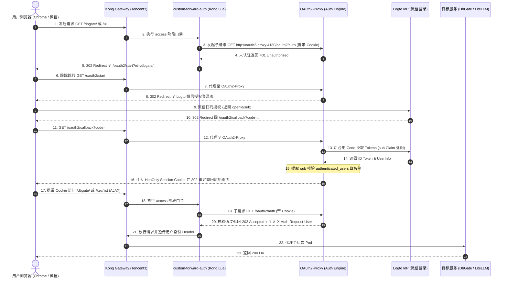

# 技术方案与实施计划：Kong Gateway 集成 Logto OAuth2 + 微信登录统一安全访问控制 (SSO)

- **文档版本**：v2.0.0 (架构评审升级版 · 基于 Celia 评审建议全面重构)
- **更新时间**：2026-08-31
- **适用节点**：Tencent3 (腾讯云 K3s / Kong Gateway 节点 `tencent-dp1-cluster`)
- **目标受护服务**：DbGate 控制台、LiteLLM UI (Web 管理端及管理 API) 及 LiteLLM API (OpenAI 兼容直连)
- **交付仓库**：`https://github.com/nvd11/my-argocd-manifests`

---

## 1. 方案背景与架构目标

### 1.1 现状与核心痛点
1. **认证碎片化与单点控制风险**：目前集群内暴露的控制台服务（DbGate、LiteLLM Web UI）依赖各自内置账密或基础 Basic-Auth，缺乏统一的身份管理源（IdP）、集中的会话生命周期管控与跨服务单点登录（SSO）能力。
2. **移动端与微信登录诉求**：日常运维与模型管理需要便捷的单点登录体验，期望支持微信扫码直接登录，免去频繁输入复杂账密的痛点。
3. **混合流量冲突与安全暴露面**：
   - LiteLLM 既承载供管理员配置的 Web UI（基于 Next.js 开发，包含大量前端静态资源与后台管理 API），又承载供外部 Agent/脚本通过 `Bearer sk-...` 调用的 LLM 推理接口；
   - 若直接对整个 Service 开启全局 OAuth2 拦截，会导致所有自动化 API 客户端因 `302 Found` 重定向而异常瘫痪；
   - 若保护范围过窄（仅匹配 `/ui`），会导致前端静态资源（`/_next/*`）及敏感管理接口（`/key/*`、`/user/*`、`/spend/*` 等）裸露在无鉴权公网下。

### 1.2 架构设计目标
1. **统一单点登录 (SSO) 与会话闭环**：以 **Logto** 作为集群核心 OIDC Identity Provider (IdP)，集成微信连接器（及 GitHub/Google/邮箱备用通道），统一纳管用户身份，并支持 OIDC End-Session 全链路登出闭环。
2. **Kong OSS 社区版原生 Forward-Auth**：针对开源版 Kong Gateway（KIC）不识别 Nginx `external-auth` 注解且无官方 Enterprise 插件的现状，基于成熟的 Lua Subrequest / 反代机制实现与 **OAuth2-Proxy** 的无缝鉴权联动。
3. **微服务与自动化流量精准分流 (Zero Trust)**：
   - **控制台与管理端 (Web UI & Admin APIs)**：强制走 OAuth2 认证与微信/社交扫码登录，下发加密 Session Cookie 并做白名单过滤；
   - **推理/Agent 流量 (LLM API)**：独立路径（`/litellm/v1/*`）仅校验 `Bearer sk-...` 虚拟 Key，免除 OAuth2 拦截。
4. **纯声明式 GitOps 交付**：全面对齐仓库现有的 `my-shared-helm-charts` (Helm Application-of-Applications) 模式，所有清单统一收拢在 `argocd-apps/` 与 `infrastructure/` 中，零裸部署、零配置分裂。

---

## 2. 总体技术架构与流量拓扑

### 2.1 架构拓扑图

```
                         ┌──────────────────────────────────────────────────────────┐
                         │                    Logto 身份认证中心                     │
                         │   (OIDC IdP · 微信扫码 / GitHub / Google / Email Passcode)  │
                         └────────────────────────────▲─────────────────────────────┘
                                                      │ OIDC Auth / Token / Session End
                                                      ▼
[ 用户浏览器 / 微信扫码 ] ──► [ Kong Gateway (Tencent3 Node · KIC) ]
                                    │
                                    ├── [未认证 UI 流量] ──(302 重定向)──► Logto 统一登录页
                                    ├── [鉴权拦截 Subrequest] ─────────► OAuth2-Proxy (Port 4180)
                                    │                                      └── [微信用户 sub 标识校验]
                                    │
                                    ▼ [鉴权通过 / Session Cookie 有效]
                     ┌──────────────┴───────────────────────────────────────────┐
                     │                                                          │
                     ▼                                                          ▼
           [ DbGate Service ]                                         [ LiteLLM Service ]
          (/dbgate/* SPA 管理端)                                      ├── UI & 管理 API (OAuth2 保护)
                                                                      │   (/ui, /_next, /key, /user, ...)
                                                                      └── 模型推理 API (Bearer Key 放行)
                                                                          (/litellm/v1/chat/completions)
```

### 2.2 核心鉴权时序流程 (Mermaid)



---

## 3. 核心技术选型与关键设计纠偏

### 3.1 关键概念纠偏：Kong OSS (社区版) Forward-Auth 选型

| 方案类别 | 实现机制 | 优势 | 劣势 | 结论 |
| :--- | :--- | :--- | :--- | :---: |
| ❌ **Nginx 注解方案** | `nginx.ingress.kubernetes.io/auth-url` | Nginx Ingress 常见 | **Kong OSS 社区版完全不识别该注解**，直接失效 | ❌ 坚决废弃 |
| ❌ **Kong 官方插件** | `forward-auth` / `openid-connect` | 官方原生 | **仅限 Kong Enterprise 企业商业版**，开源版无法使用 | ❌ 无法采用 |
| ✅ **方案 A：自定义 Lua Forward-Auth 插件 (推荐)** | 编写 `oauth2-forward-auth` KongPlugin，基于 `lua-resty-http` 向 OAuth2-Proxy 发起 subrequest | 架构解耦、高性能、保持 Kong 作为绝对统一网关、与现有 `custom-auth` 经验完全同构 | 需维护轻量 Lua 脚本 | 🌟 **首选推荐** |
| ✅ **方案 B：Kong Upstream 链式反代** | Kong 将受护路径的 Upstream 直接指向 OAuth2-Proxy，由 OAuth2-Proxy 反代至后端 | 零 Lua 代码 | 增加一层 HTTP 代理转发 hop，且配置耦合度较高 | 备选方案 |

---

## 4. 关键痛点与避坑深度设计 (Critical Pitfalls & Solutions)

### 4.1 微信登录无 Email 属性引发的 OAuth2-Proxy 报错（高危致命坑）

* **隐患机理**：OAuth2-Proxy 默认按标准 OIDC 协议期望从 ID Token 中提取 `email` Claim 进行身份标识和白名单校验。但微信扫码登录（WeChat Connector）仅返回微信 `openid` / `unionid`，Logto 下发的 ID Token 默认**不包含 email 字段**。若使用默认配置，扫码回调后 OAuth2-Proxy 会直接抛出 `Error: user email not found in id_token` 并返回 500/403 崩溃。
* **终极对策配置**：在 OAuth2-Proxy 的启动参数与配置文件中，必须显式覆盖以下参数：
  ```ini
  # oauth2-proxy.cfg
  provider = "oidc"
  oidc_issuer_url = "https://<your-logto-domain>/oidc"
  
  # 🎯 核心修复：强制使用 sub (Logto User ID) 替代 email 作为主身份 Claim
  user_id_claim = "sub"
  oidc_email_claim = "sub"
  email_domains = ["*"]
  insecure_oidc_allow_unverified_email = true
  
  # 🎯 白名单机制：直接匹配 Logto 用户唯一的 sub ID
  authenticated_users = [
    "user_jason_master_sub_id",     # 主人的 Logto 用户 ID
    "user_renee_sub_id",            # 授权家庭成员的 Logto 用户 ID
  ]
  ```

### 4.2 微信开放平台资质门槛与多通道 IdP 策略
* **资质限制**：PC 端微信网站扫码登录必须在【微信开放平台】创建网站应用并完成企业/个体工商户认证（每年需支付 300 元认证审核费），个人开发者账号无法开通。
* **平滑接入策略**：
  1. **第一阶段（零等待开发上线）**：在 Logto 中同时启用 **GitHub 登录 / Google 登录 / 邮箱无密码验证码 (Email Passcode)**，立即跑通 OAuth2-Proxy + Kong 全链路；
  2. **第二阶段（资质就绪无缝切换）**：企业认证通过后，直接在 Logto 控制台启用 `WeChat Web` 社交连接器，**底层网关和 K8s 清单无需任何改动**，用户前端直接多出微信扫码入口。

### 4.3 全链路登出闭环 (OIDC End-Session Logout)
* **隐患**：单纯访问 `/oauth2/sign_out` 仅清除了 OAuth2-Proxy 在浏览器侧的 Session Cookie，Logto 服务端的 SSO 会话仍然处于活跃状态，用户再次点击登录会瞬间静默自动重新登录，无法切换账号。
* **对策**：配置 OAuth2-Proxy 的登出重定向：
  ```ini
  signout_url = "https://<your-logto-domain>/oidc/session/end?post_logout_redirect_uri=https://gw.jppwl.asia/dbgate/"
  ```
  实现浏览器本地 Cookie 清除 + Logto IdP 服务端 SSO 会话销毁的双重彻底注销。

---

## 5. 受护服务精细化路由与 API 保护矩阵

### 5.1 DbGate 路由策略
* **路径匹配**：`/dbgate` 及 `/dbgate/*`
* **鉴权策略**：挂载 `oauth2-forward-auth` KongPlugin，未携带合法 Session Cookie 的请求全部 302 重定向至登录。
* **环境适配**：`WEB_ROOT=/dbgate`。

### 5.2 LiteLLM 完整路由防护矩阵（对齐现有 `litellm-svc-app.yaml`）

对齐现有生产 Helm 配置，将 LiteLLM 的流量分为 **【受护 UI 与管理面】** 和 **【免拦截推理数据面】**：

```yaml
# ====================================================================
# 1. LiteLLM Web UI 前端与全部后台管理 API (强 OAuth2 / 微信登录保护)
# ====================================================================
extraRoutes:
  ui-route:
    parentGateway: kong-main-gateway
    parentGatewayNamespace: default
    annotations:
      konghq.com/plugins: oauth2-forward-auth # 🎯 挂载 OAuth2 Forward-Auth 门禁
    rules:
      # (A) 前端单页应用与静态资源
      - matches:
          - path: /ui
          - path: /litellm-asset-prefix
          - path: /_next
          - path: /fallback
          - path: /swagger
          - path: /get_favicon
          - path: /get_logo_url
          - path: /favicon.ico
      # (B) 控制台登录与流程端点
      - matches:
          - path: /login
          - path: /v2
          - path: /v3
          - path: /auth
          - path: /sso
          - path: /onboarding
          - path: /invitation
      # (C) 敏感资源管理 API (防止外网未授权调用)
      - matches:
          - path: /key
          - path: /user
          - path: /team
          - path: /customer
          - path: /organization
          - path: /project
          - path: /spend
          - path: /budget
      # (D) 模型配置与全局设定 API
      - matches:
          - path: /models
          - path: /model
          - path: /model_group
          - path: /model_hub
          - path: /routes
          - path: /global
          - path: /config
          - path: /settings
      # (E) 监控审计与探活端点
      - matches:
          - path: /health
          - path: /cache
          - path: /alerting
          - path: /audit

# ====================================================================
# 2. LiteLLM 模型推理数据面 API (免 OAuth2 拦截 · Bearer Token 直连)
# ====================================================================
route:
  enabled: true
  parentGateway: kong-main-gateway
  path: /litellm
  pathType: PathPrefix
  annotations:
    konghq.com/strip-path: "true"
    # 🎯 严禁挂载 oauth2 插件，仅由 LiteLLM 校验 sk-... 虚拟 Key
```

---

## 6. GitOps 目录结构规范 (`my-argocd-manifests`)

严格遵循当前仓库的 **Helm Application 编排标准**：

```
my-argocd-manifests/
├── argocd-apps/                                 # ArgoCD 顶层 Application 注册
│   ├── root-bootstrap-app.yaml
│   ├── kong-infra-app.yaml
│   ├── oauth2-proxy-app.yaml                    # [新增] OAuth2-Proxy 服务注册 (使用 generic-web-service)
│   ├── dbgate-app.yaml                          # [更新] values 注入 oauth2-forward-auth 插件注解
│   └── litellm-svc-app.yaml                     # [更新] extraRoutes.ui-route 注入 oauth2 插件注解
│
├── infrastructure/                              # 基础网关与身份基建
│   ├── kong-gateway/
│   │   ├── Gateway.yaml
│   │   ├── GatewayClass.yaml
│   │   └── plugins/
│   │       └── oauth2-forward-auth-plugin.yaml  # [新增] 自定义 Lua Forward-Auth KongPlugin
│   └── auth/
│       └── oauth2-proxy-values.yaml             # OAuth2-Proxy Helm 自定义参数 (或直接写在 app.yaml)
│
└── docs/                                        # 架构与方案文档
    └── kong-logto-wechat-sso-plan.md            # 本架构与实施规划文档
```

---

## 7. 分阶段实施路线图 (Roadmap)

```
┌─────────────────────────────────────────────────────────────────────────────┐
│                            实施五阶段规划 (Roadmap)                          │
├─────────────┬─────────────┬─────────────┬─────────────┬─────────────────────┤
│   阶段一    │   阶段二    │   阶段三    │   阶段四    │       阶段五        │
│ Logto 应用  │ OAuth2-Proxy│ Kong Lua    │ DbGate &    │ 全链路连通性 /      │
│ 与微信/IdP  │ GitOps 交付 │ Forward-Auth│ LiteLLM 路由│ 白名单与登出验收    │
└─────────────┴─────────────┴─────────────┴─────────────┴─────────────────────┘
```

### 阶段一：Logto IdP 端配置与 OIDC 应用创建
1. 在 Logto 控制台创建 `Traditional Web App`，记录 Client ID、Client Secret 与 OIDC Discovery URL；
2. 配置 Redirect URI 为 `https://gw.jppwl.asia/oauth2/callback`；
3. 配置 Post Sign-out Redirect URI 为 `https://gw.jppwl.asia/dbgate/`；
4. 开启 GitHub / Google / Email Passcode 登录通道（微信开放平台审核通过后一键开启 WeChat Web）；
5. 关闭 Logto 公开自由注册（Disable Public Sign-up）。

### 阶段二：OAuth2-Proxy GitOps 声明式部署
1. 在 K3s 集群中部署 `oauth2-proxy`，利用 ExternalSecret 或 K8s Secret 注入 `client-id`、`client-secret` 与 `cookie-secret`；
2. 应用第 4.1 节中的 `user_id_claim="sub"` 及白名单配置；
3. 暴露 ClusterIP Service：`oauth2-proxy.auth.svc.cluster.local:4180`。

### 阶段三：Kong Forward-Auth Lua 插件挂载
1. 编写 `oauth2-forward-auth` KongPlugin，在 `access` 阶段拦截请求：
   - 提取请求中的 Cookie 向 `http://oauth2-proxy.auth.svc.cluster.local:4180/oauth2/auth` 发起 `lua-resty-http` HEAD/GET 验证；
   - 若返回 202/200，则提取 `X-Auth-Request-*` Header 透传并放行；
   - 若返回 401，则构造 302 重定向至 `/oauth2/start?rd=` + `ngx.var.request_uri`。
2. 在 Kong 网关上开辟 `/oauth2/*` 独立公开路由直接代理至 `oauth2-proxy`。

### 阶段四：DbGate 与 LiteLLM 接入
1. 更新 `argocd-apps/dbgate-app.yaml`，Service 注解关联 `oauth2-forward-auth`；
2. 更新 `argocd-apps/litellm-svc-app.yaml`，在 `extraRoutes.ui-route` 下关联 `oauth2-forward-auth`，保持 `route` (/litellm) 独立免拦截。

### 阶段五：验收测试与边界验证
按照下表逐项验证功能闭环：

| 测试用例 ID | 测试场景 | 操作步骤 | 预期结果 |
| :---: | :--- | :--- | :--- |
| **TC-01** | 未登录访问 DbGate | 浏览器打开 `https://gw.jppwl.asia/dbgate/` | 自动 302 跳转至 Logto 登录页，显示社交/扫码登录选项。 |
| **TC-02** | 授权登录与 SPA 加载 | 使用白名单内的账号扫码/授权登录 | 顺利回调并进入 DbGate 控制台，数据库表加载与 SQL 执行正常。 |
| **TC-03** | LiteLLM UI 联动 SSO | 在同一浏览器打开 `https://gw.jppwl.asia/ui` | 命中 Session Cookie，秒级免密直接进入 LiteLLM 控制台。 |
| **TC-04** | LiteLLM 敏感 API 保护 | 未登录状态下通过 Postman 访问 `/key/list` | 请求被拦截并返回 401 / 302，无法刺探模型与 Key 列表。 |
| **TC-05** | LiteLLM 模型推理 API 穿透 | `curl -H "Authorization: Bearer sk-..." https://gw.jppwl.asia/litellm/v1/chat/completions` | 直接返回模型推理 JSON，无 302 重定向，不阻塞 Agent 调用。 |
| **TC-06** | 陌生人扫码拦截测试 | 使用未在白名单中的微信号/社交账号登录 | Logto 提示未获注册授权，或 OAuth2-Proxy 返回 403 Forbidden。 |
| **TC-07** | 全链路彻底登出 (Sign Out) | 访问 `/oauth2/sign_out` | 清除本地 Cookie 同时注销 Logto 服务端 Session，再次访问重新触发完整认证。 |

---

## 8. 总结

升级后的 v2.0 方案彻底解决了 **Kong OSS 社区版插件兼容性**、**微信无 Email 属性导致的 OAuth2-Proxy 崩溃** 以及 **LiteLLM Next.js 前端路由与管理 API 保护不全** 等关键痛点，并与仓库现有的 Helm GitOps 架构保持了高度一致性与纯洁性。
