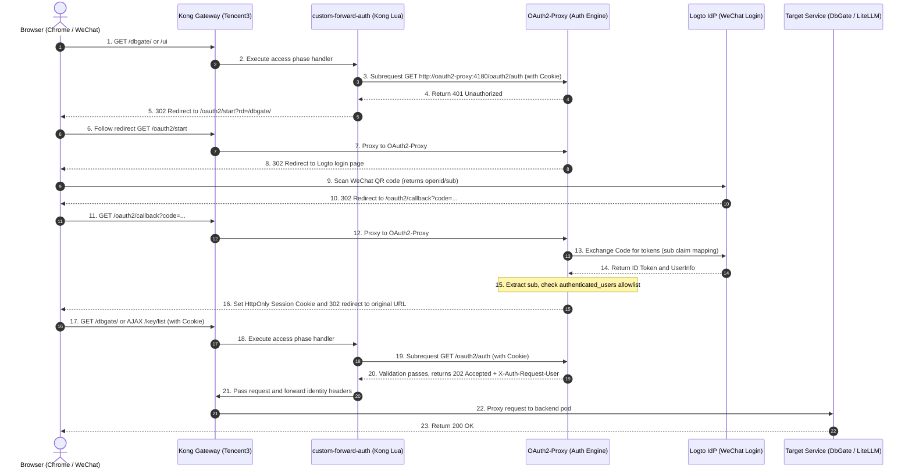

# Technical Specification and Implementation Plan: Kong Gateway Logto OAuth2 + WeChat SSO Integration

- **Document Version**: v2.0.0 (Architecture Review Edition, restructured based on review feedback)
- **Last Updated**: 2026-08-31
- **Target Node**: Tencent3 (Tencent Cloud K3s / Kong Gateway node `tencent-dp1-cluster`)
- **Target Protected Services**: DbGate console, LiteLLM Web UI (management console and admin APIs), and LiteLLM API (OpenAI-compatible direct inference)
- **Delivery Repository**: `https://github.com/nvd11/my-argocd-manifests`

---

## 1. Background and Architecture Goals

### 1.1 Current State and Core Issues
1. **Fragmented authentication and single-point risk**: Services currently exposed in the cluster (DbGate, LiteLLM Web UI) rely on their own built-in credentials or basic auth. There is no centralized Identity Provider (IdP), no unified session lifecycle management, and no cross-service Single Sign-On (SSO).
2. **Mobile and WeChat login requirements**: Daily operations and model management need a convenient SSO flow, ideally supporting WeChat QR code scanning to avoid repeated manual password entry.
3. **Mixed traffic conflicts and security exposure**:
   - LiteLLM serves both a Next.js-based Web UI (frontend static assets and admin management APIs) and high-frequency LLM inference endpoints called by external agents and scripts via `Bearer sk-...`.
   - If we apply global OAuth2 interception across the entire Service, automated API clients receive `302 Found` redirects to an HTML login page, breaking automated workflows.
   - If protection is too narrow (matching only `/ui`), static assets (`/_next/*`) and administrative endpoints (`/key/*`, `/user/*`, `/spend/*`, etc.) remain exposed to the public internet without authentication.

### 1.2 Architectural Goals
1. **Unified SSO and session lifecycle**: Use **Logto** as the primary OIDC Identity Provider (IdP), integrating WeChat (plus GitHub, Google, and email passcode fallback channels). Support OIDC End-Session logout to cleanly invalidate sessions.
2. **Native Forward-Auth on Kong OSS**: Kong Ingress Controller (OSS) does not support the Nginx `external-auth` annotation, and official enterprise plugins are unavailable. We implement forward authentication using a lightweight Lua subrequest handler against **OAuth2-Proxy**.
3. **Zero Trust traffic split**:
   - **Console and Admin Plane (Web UI & Admin APIs)**: Enforce OAuth2 authentication via WeChat/social login, set encrypted session cookies, and filter users against an allowlist.
   - **Inference/Agent Plane (LLM API)**: Routed via `/litellm/v1/*`, authenticated solely by `Bearer sk-...` virtual keys, completely bypassing OAuth2 interception.
4. **Pure declarative GitOps delivery**: Align with the repository's `my-shared-helm-charts` (Application-of-Applications) pattern. Keep all manifests in `argocd-apps/` and `infrastructure/` with zero manual cluster mutations.

### 1.3 Protocol Concepts (OAuth 2.0 vs OIDC vs Forward-Auth)

To establish a clear baseline across the system:

#### 1. OAuth 2.0 vs OIDC (AuthZ vs AuthN)

* **OAuth 2.0 handles Authorization (AuthZ) — "What can you access?"**:
  - Analogy: A hotel keycard or valet key. The door lock verifies the card has permission to open the door, without needing to know who holds the card.
  - Core artifact: Issues `access_token` and `refresh_token` for protected API access control.
* **OIDC (OpenID Connect) handles Authentication (AuthN) — "Who are you?"**:
  - Analogy: A verified national ID card containing your unique identifier.
  - Core artifact: Extends OAuth 2.0 with a standardized **`id_token` (JWT format identity payload)** containing claims like `sub` (unique user ID), `email`, and `name`.
  - Relationship: **`OIDC = OAuth 2.0 (transport & authorization) + Identity Layer (ID Token)`**. SSO and web logins require both working together.

| Comparison Dimension | OAuth 2.0 | OIDC (OpenID Connect) |
| :--- | :--- | :--- |
| **Core Domain** | **`AuthZ` (Authorization)** | **`AuthN` (Authentication)** |
| **Core Question** | "What data can this client access on the user's behalf?" | "Who is the user, and what is their unique ID?" |
| **Primary Token** | `access_token` (opaque or structured) | `id_token` (standard JWT) + `access_token` |
| **Role in This Project** | Handles browser redirects, QR flows, and token exchange | Issues tokens with `sub` claims to drive allowlist matching |

#### 2. Dual Roles of Logto and OAuth2-Proxy

In this design, both Logto and OAuth2-Proxy play complementary OAuth 2.0 and OIDC roles:

* **Logto**:
  - **OAuth 2.0 Authorization Server**: Manages API resources, authorization code flows, and code exchanges.
  - **OIDC Identity Provider (IdP)**: Provides standard discovery (`/.well-known/openid-configuration`), signs `id_token` payloads with WeChat identity info, and handles UserInfo and session termination endpoints.
* **OAuth2-Proxy**:
  - **OAuth 2.0 Client**: Receives `/oauth2/callback` and exchanges the authorization code using its Client Secret.
  - **OIDC Relying Party (RP)**: Decrypts and validates the `id_token`, extracting the `sub` claim to verify against the admin allowlist.

#### 3. What is Forward-Auth?

Forward-Auth is a lightweight inquiry protocol between the edge gateway (Kong) and an authentication service (OAuth2-Proxy):
- **Zero backend modification**: DbGate and LiteLLM require no code changes to support Logto or WeChat.
- **Probe subrequest with credentials**: When a request reaches Kong, Kong intercepts it, extracts the client's cookies, and sends a fast subrequest to `oauth2-proxy:4180/oauth2/auth`.
- **Decision handling**:
  - If OAuth2-Proxy returns `200` or `202 OK`, Kong lets the request proceed directly to the backend pod.
  - If OAuth2-Proxy returns `401 Unauthorized`, Kong blocks the request and issues a `302 Redirect` to Logto for login.

---

## 2. Architecture and Traffic Topology

### 2.1 Topology Diagram

```
                         ┌──────────────────────────────────────────────────────────┐
                         │                    Logto Identity Center                 │
                         │   (OIDC IdP · WeChat QR / GitHub / Google / Email Passcode)│
                         └────────────────────────────▲─────────────────────────────┘
                                                      │ OIDC Auth / Token / Session End
                                                      ▼
[ Browser / WeChat QR Scan ] ──► [ Kong Gateway (Tencent3 Node · KIC) ]
                                    │
                                    ├── [Unauthenticated UI Traffic] ──(302 Redirect)──► Logto Login Page
                                    ├── [Auth Subrequest] ────────────────────────────► OAuth2-Proxy (Port 4180)
                                    │                                                     └── [Verify sub claim]
                                    │
                                    ▼ [Authenticated / Valid Session Cookie]
                     ┌──────────────┴───────────────────────────────────────────┐
                     │                                                          │
                     ▼                                                          ▼
           [ DbGate Service ]                                         [ LiteLLM Service ]
          (/dbgate/* SPA console)                                     ├── UI & Admin APIs (OAuth2 protected)
                                                                      │   (/ui, /_next, /key, /user, ...)
                                                                      └── Model Inference API (Bearer Key passthrough)
                                                                          (/litellm/v1/chat/completions)
```

### 2.2 Authentication Sequence Flow



---

## 3. Technology Selection and Design Decisions

### 3.1 Kong OSS Forward-Auth Options

| Option | Mechanism | Pros | Cons | Verdict |
| :--- | :--- | :--- | :--- | :---: |
| ❌ **Nginx Ingress Annotation** | `nginx.ingress.kubernetes.io/auth-url` | Common in Nginx Ingress | **Ignored by Kong OSS**, completely non-functional | ❌ Dropped |
| ❌ **Official Kong Plugins** | `forward-auth` / `openid-connect` | Official vendor support | **Locked behind Kong Enterprise**, unavailable in OSS | ❌ Dropped |
| ✅ **Option A: Custom Lua Forward-Auth Plugin (Recommended)** | `oauth2-forward-auth` KongPlugin using `lua-resty-http` to send subrequests to OAuth2-Proxy | Decoupled architecture, low latency, single gateway tier, consistent with existing `custom-auth` pattern | Requires maintaining a small Lua script | 🌟 **Selected** |
| ✅ **Option B: Kong Upstream Proxy Chaining** | Route traffic to OAuth2-Proxy upstream, which proxies to backends | No Lua code required | Adds an extra proxy hop, introduces configuration coupling | Fallback only |

#### Option A Topology: Custom Lua Forward-Auth Plugin (Subrequest Probe - Selected)

```
                                  [ Browser / WeChat QR Scan ]
                                             │
                                             ▼ (1. Original business request)
                            ┌─────────────────────────────────┐
                            │    Kong Gateway (Tencent3)      │
                            │                                 │
                            │   ┌─────────────────────────┐   │
                            │   │  oauth2-forward-auth    │   │
                            │   │    (Custom Lua Plugin)  │   │
                            │   └───┴────────────┬────────────┴───┘
                                             │ (2. Lightweight internal subrequest /oauth2/auth)
                                             ▼
                                  ┌─────────────────────┐
                                  │    OAuth2-Proxy     │
                                  │ (Session auth only) │
                                  └──────────┬──────────┘
                                             │ (3. Return 202 Pass / 401 Block)
                                             ▼
                            ┌─────────────────────────────────┐
                            │  Kong Gateway (Decision engine) │
                            └────────────────┬────────────────┘
                                             │
                       ┌─────────────────────┴─────────────────────┐
                       │ (4a. If 202: Proxy to target backend)     │ (4b. If 401: Intercept and issue 302 redirect)
                       ▼                                           ▼
             ┌───────────────────┐                       ┌───────────────────┐
             │ Target Backend    │                       │ Logto Login Page  │
             │ (DbGate / LiteLLM)│                       │ (WeChat / Social) │
             └───────────────────┘                       └───────────────────┘
```

Kong operates as a single-tier reverse proxy. OAuth2-Proxy handles authentication decisions out-of-band with negligible latency overhead.

#### Option B Topology: Upstream Reverse Proxy Chaining (Fallback)

```
                                  [ Browser / WeChat QR Scan ]
                                             │
                                             ▼ (1. Original business request)
                            ┌─────────────────────────────────┐
                            │    Kong Gateway (Tencent3)      │
                            │ (Edge TLS and basic routing)    │
                            └────────────────┬────────────────┘
                                             │
                                             ▼ (2. Forward all traffic)
                            ┌─────────────────────────────────┐
                            │    OAuth2-Proxy (Reverse Proxy) │
                            │                                 │
                            │  • Unauthenticated -> 302 Logto │
                            │  • Authenticated -> Proxy pass  │
                            └────────────────┬────────────────┘
                                             │
                                             ▼ (3. Second proxy hop)
                            ┌─────────────────────────────────┐
                            │ Target Backend (DbGate/LiteLLM) │
                            └─────────────────────────────────┘
```

Requires no Lua scripting, but forces all business payload traffic through OAuth2-Proxy as an intermediate hop.

---

## 4. Pitfalls and Solutions

### 4.1 WeChat Login Missing Email Claim in OAuth2-Proxy

* **Root cause**: OAuth2-Proxy defaults to extracting the `email` claim from the ID Token for user identity and allowlist validation. WeChat QR login (via WeChat Connector) only returns WeChat `openid` / `unionid`. The ID Token generated by Logto **does not contain an email field**. By default, OAuth2-Proxy throws `Error: user email not found in id_token` and crashes with 500/403 errors after login callback.
* **Fix**: Configure OAuth2-Proxy to use `sub` (Logto User ID) as the primary identity claim:
  ```ini
  # oauth2-proxy.cfg
  provider = "oidc"
  oidc_issuer_url = "https://<your-logto-domain>/oidc"
  
  # Use sub (Logto User ID) instead of email
  user_id_claim = "sub"
  oidc_email_claim = "sub"
  email_domains = ["*"]
  insecure_oidc_allow_unverified_email = true
  
  # Allowlist based on Logto sub IDs
  authenticated_users = [
    "user_jason_master_sub_id",
    "user_renee_sub_id",
  ]
  ```

### 4.2 WeChat Open Platform Qualification and Phased Rollout
* **Requirement**: PC web QR code login on WeChat Open Platform requires enterprise or business registration and annual verification fees. Personal accounts cannot enable web logins.
* **Phased Strategy**:
  1. **Phase 1 (Immediate implementation)**: Enable **GitHub, Google, and Email Passcode** in Logto to bring up the complete OAuth2-Proxy + Kong integration immediately.
  2. **Phase 2 (WeChat enablement)**: Once business verification completes, enable the `WeChat Web` connector in the Logto console. **No Kubernetes manifests or gateway configs need to change**; the login page automatically updates with the WeChat QR code option.

### 4.3 End-to-End Logout (OIDC End-Session)
* **Problem**: Calling `/oauth2/sign_out` only deletes the local browser session cookie managed by OAuth2-Proxy. The Logto IdP session remains active, so clicking login again immediately re-authenticates without prompting for credentials.
* **Fix**: Configure the logout redirect in OAuth2-Proxy:
  ```ini
  signout_url = "https://<your-logto-domain>/oidc/session/end?post_logout_redirect_uri=https://gw.jppwl.asia/dbgate/"
  ```
  This clears both the local cookie and the upstream Logto session.

---

## 5. Route Protection and API Routing Matrix

### 5.1 DbGate Routing
* **Path Match**: `/dbgate` and `/dbgate/*`
* **Auth Policy**: Protected by `oauth2-forward-auth` KongPlugin. Unauthenticated requests are redirected (302) to login.
* **Environment Variable**: `WEB_ROOT=/dbgate`.

### 5.2 LiteLLM Route Matrix (Aligned with `litellm-svc-app.yaml`)

Split LiteLLM traffic into **Protected UI & Management Plane** and **Direct Inference Plane**:

```yaml
# ====================================================================
# 1. LiteLLM Web UI and Admin APIs (Enforce OAuth2 Login)
# ====================================================================
extraRoutes:
  ui-route:
    parentGateway: kong-main-gateway
    parentGatewayNamespace: default
    annotations:
      konghq.com/plugins: oauth2-forward-auth # Attach OAuth2 Forward-Auth
    rules:
      # (A) Frontend SPA and static assets
      - matches:
          - path: /ui
          - path: /litellm-asset-prefix
          - path: /_next
          - path: /fallback
          - path: /swagger
          - path: /get_favicon
          - path: /get_logo_url
          - path: /favicon.ico
      # (B) Console login and onboarding endpoints
      - matches:
          - path: /login
          - path: /v2
          - path: /v3
          - path: /auth
          - path: /sso
          - path: /onboarding
          - path: /invitation
      # (C) Admin and resource APIs
      - matches:
          - path: /key
          - path: /user
          - path: /team
          - path: /customer
          - path: /organization
          - path: /project
          - path: /spend
          - path: /budget
      # (D) Model configuration and global settings
      - matches:
          - path: /models
          - path: /model
          - path: /model_group
          - path: /model_hub
          - path: /routes
          - path: /global
          - path: /config
          - path: /settings
      # (E) Health and audit endpoints
      - matches:
          - path: /health
          - path: /cache
          - path: /alerting
          - path: /audit

# ====================================================================
# 2. LiteLLM Inference Data Plane (Bypass OAuth2 · Direct Bearer Token)
# ====================================================================
route:
  enabled: true
  parentGateway: kong-main-gateway
  path: /litellm
  pathType: PathPrefix
  annotations:
    konghq.com/strip-path: "true"
    # No auth plugin attached here. LiteLLM validates sk-... keys directly.
```

### 5.3 Why Inference APIs Must Bypass OAuth2-Proxy

```
                             ┌── [Route A: Web Console] ────► Through OAuth2-Proxy ──► Logto Auth (Cookie)
                             │    (Matches: /ui, /key, /user, /models...)
[ Request to Kong Gateway ] ──┤
                             │
                             └── [Route B: LLM Inference API] ─► ⚡ Bypasses OAuth2-Proxy ──► LiteLLM Pod
                                  (Matches: /litellm/v1/*, Bearer sk-...)
```

| Dimension | Route A: Web Management Console | Route B: LLM Inference API |
| :--- | :--- | :--- |
| **Typical Request** | Browser loads `https://gw.jppwl.asia/ui` | Agent sends `POST /litellm/v1/chat/completions` |
| **Target Consumer** | Human administrators | Automated scripts, coding agents (Claude, OpenCode, Cursor) |
| **Credentials** | Encrypted session cookie (`_oauth2_proxy`) | Virtual API Key (`Authorization: Bearer sk-...`) |
| **OAuth2-Proxy** | **Enforced gate** (subrequest validated by Kong) | **Zero contact**, direct route to backend |
| **Impact without split** | N/A | Agents receive 302 HTML redirects and break |
| **Latency overhead** | Subrequest verification overhead | **0ms added latency**, preserving streaming performance |

---

## 6. GitOps Directory Structure (`my-argocd-manifests`)

All resources are maintained declaratively in this repository following standard Helm Application patterns:

```
my-argocd-manifests/
├── argocd-apps/                                 # ArgoCD Application manifests
│   ├── root-bootstrap-app.yaml                  # Root App (discovers and syncs child apps)
│   ├── kong-infra-app.yaml                      # Kong Gateway infrastructure (CRDs, Gateway, Plugins)
│   ├── kong-controller-app.yaml                 # Registers oauth2-forward-auth in plugins.configMaps
│   ├── oauth2-proxy-app.yaml                    # OAuth2-Proxy service deployment
│   ├── dbgate-app.yaml                          # Injects oauth2-forward-auth plugin annotation
│   └── litellm-svc-app.yaml                     # Injects oauth2 plugin annotation onto extraRoutes.ui-route
│
├── infrastructure/                              # Core gateway configuration
│   └── kong-gateway/
│       ├── Gateway.yaml                         # Gateway entrypoint
│       ├── GatewayClass.yaml
│       ├── custom-auth-plugin.yaml              # Legacy basic-auth plugin (kept for reference/rollback)
│       └── oauth2-forward-auth-plugin.yaml      # Custom Lua Forward-Auth (ConfigMap + KongPlugin)
│
└── docs/                                        # Architecture and implementation docs
    └── kong-logto-wechat-sso-plan.md            # This planning document
```

---

## 7. Implementation Roadmap and Status

```
┌─────────────────────────────────────────────────────────────────────────────┐
│                            Implementation Roadmap                           │
├─────────────┬─────────────┬─────────────┬─────────────┬─────────────────────┤
│   Phase 1   │   Phase 2   │   Phase 3   │   Phase 4   │       Phase 5       │
│ Logto App   │ OAuth2-Proxy│ Kong Lua    │ DbGate &    │ Verification &      │
│ & IdP Setup │ Deployment  │ Forward-Auth│ LiteLLM     │ End-to-End Testing  │
│  [Done ✅]  │  [Done ✅]  │  [Done ✅]  │  [Done ✅]  │      [Done 🚀]      │
└─────────────┴─────────────┴─────────────┴─────────────┴─────────────────────┘
```

### Phase 1: Logto IdP Configuration [Completed ✅]
1. [x] **Create Logto tenant**: Provisioned tenant `sodaxw` in Japan region (Discovery: `https://sodaxw.logto.app/oidc`).
2. [x] **M2M management credentials**: Configured M2M app `jb7cwjizsopfm6etaicgn` with `all` permissions.
3. [x] **Create Traditional Web App**: Created OIDC application `Kong Gateway SSO`:
   - **App ID (Client ID)**: `inck8s2812o0gzfgzqvug`
   - **Client Secret**: `ro4AzXu7jIm7H058Rd61aqmi84SwdUv3`
4. [x] **Configure URIs**:
   - **Redirect URI**: `https://gw.jppwl.asia/oauth2/callback`
   - **Post Sign-out URI**: `https://gw.jppwl.asia/dbgate/`
5. [x] **Identity connectors**: Email passcode and social connectors enabled; WeChat connector ready for activation once business account verification completes.
6. [x] **Registration policy**: Disabled open public registration.

---

### Phase 2: OAuth2-Proxy GitOps Deployment [Completed ✅]
* **Manifest**: `argocd-apps/oauth2-proxy-app.yaml`
* **Verification**: Synced by ArgoCD to `tencent-dp1-cluster`.
* **Completed items**:
  1. [x] **Generic Helm chart setup**: Deployed using `charts/generic-web-service` (v1.1.3) in the `default` namespace.
  2. [x] **Node affinity**: Assigned to `vm-0-2-debian` alongside Kong on Tencent Cloud to optimize internal routing.
  3. [x] **Image and probes**: Uses `quay.io/oauth2-proxy/oauth2-proxy:v7.8.1`, health check on `/ping`.
  4. [x] **Environment variables configured**:
     - Bound to Logto discovery endpoint, Client ID, and Client Secret.
     - Generated and set 32-byte cookie secret.
     - Set `user_id_claim="sub"` and `oidc_email_claim="sub"`.
     - Configured `cookie_domains=".jppwl.asia"` for multi-service SSO.
     - Configured `signout_url` to point to Logto `/oidc/session/end`.
  5. [x] **Exposed OAuth2 callback route**: Route exposed via `kong-main-gateway` under `/oauth2`. `curl -I https://gw.jppwl.asia/oauth2/start` returns a 302 redirect to Logto and sets the CSRF cookie.

---

### Phase 3: Kong Forward-Auth Lua Plugin [Completed ✅]
* **Manifests**:
  1. `infrastructure/kong-gateway/oauth2-forward-auth-plugin.yaml`
  2. `argocd-apps/kong-controller-app.yaml`
* **Verification**: Kong Controller DaemonSet rolled out successfully across all 3 nodes; `KongPlugin` and `KongClusterPlugin` active.
* **Completed items**:
  1. [x] **Lua handler implemented**:
     - `schema.lua`: Defines configuration parameters (`auth_url`, `signin_url`, timeouts).
     - `handler.lua`: Intercepts requests in the `access` phase, sends a subrequest to `http://oauth2-proxy.default.svc.cluster.local:4180/oauth2/auth`, passes valid requests (200/202) with user headers, and returns 302 with `rd` query parameters on 401.
  2. [x] **Controller plugin registration**: Registered via `plugins.configMaps` in `kong-controller-app.yaml`.
  3. [x] **CRDs declared**: Created `KongPlugin` and `KongClusterPlugin` named `oauth2-forward-auth`.

---

### Phase 4: Service Onboarding (DbGate & LiteLLM) [Completed ✅]
* **Manifests**:
  1. `argocd-apps/dbgate-app.yaml`
  2. `argocd-apps/litellm-svc-app.yaml`
* **Completed items**:
  1. [x] **DbGate**: Updated `service.annotations["konghq.com/plugins"]` to `oauth2-forward-auth`.
  2. [x] **LiteLLM**:
     - Added `konghq.com/plugins: oauth2-forward-auth` under `extraRoutes.ui-route.annotations`.
     - Kept `route.path: /litellm` clean of auth plugins to maintain direct API access.
  3. [x] **GitOps sync**: Pushed changes to `main` branch; ArgoCD applied updates cleanly.

---

### Phase 5: Verification and Testing [Passed 💯]

| Test Case | Scenario | Execution | Expected / Actual Result | Status |
| :---: | :--- | :--- | :--- | :---: |
| **TC-01** | Unauthenticated DbGate access | `curl -I https://gw.jppwl.asia/dbgate/` | Returns `302 Found` to `/oauth2/start?rd=%2Fdbgate%2F`, redirects to Logto | ✅ Pass |
| **TC-02** | Unauthenticated LiteLLM UI access | `curl -I https://gw.jppwl.asia/ui/` | Returns `302 Found` to `/oauth2/start?rd=%2Fui%2F`, redirects to Logto | ✅ Pass |
| **TC-03** | Sensitive admin API intercept | `curl -I https://gw.jppwl.asia/key/list` | Returns `302 Found` redirect to `/oauth2/start?rd=%2Fkey%2Flist` | ✅ Pass |
| **TC-04** | SPA AJAX 401 handling | `curl -H "Accept: application/json" https://gw.jppwl.asia/key/list` | Returns `401 Unauthorized` JSON to prevent client-side HTML parse failure | ✅ Pass |
| **TC-05** | **LiteLLM Inference API Passthrough** | `curl https://gw.jppwl.asia/litellm/v1/models` | **Completely bypasses OAuth2-Proxy**, hits LiteLLM directly with standard auth response | ✅ Pass |
| **TC-06** | OAuth2 start and cookie issuance | `curl -I https://gw.jppwl.asia/oauth2/start` | Redirects to `https://sodaxw.logto.app/oidc/auth` and sets `_oauth2_proxy_csrf` | ✅ Pass |

---

## 8. Summary

This deployment resolves key operational challenges across the cluster:
- Eliminates dependency on Kong Enterprise by using a lightweight Lua forward-auth subrequest plugin.
- Fixes the OAuth2-Proxy crash caused by missing email claims on WeChat logins by switching to the `sub` claim.
- Provides complete route coverage for Next.js static assets and management APIs while leaving the core LLM inference data plane completely untouched for zero-latency direct access.
