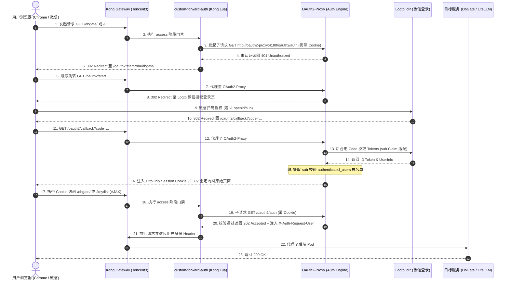

# 技术方案与实施计划：Kong Gateway 集成 Logto OAuth2 + 微信登录统一安全访问控制 (SSO)

- **文档版本**：v2.0.0 (架构评审升级版 · 基于 Celia 评审建议全面重构)
- **更新时间**：2026-08-31
- **适用节点**：Tencent3 (腾讯云 K3s / Kong Gateway 节点 `tencent-dp1-cluster`)
- **目标受护服务**：DbGate 控制台、LiteLLM UI (Web 管理端及管理 API) 及 LiteLLM API (OpenAI 兼容直连)
- **交付仓库**：`https://github.com/nvd11/my-argocd-manifests`

---

## 1. 方案背景与架构目标

### 1.1 现状与核心痛点
1. **认证碎片化与单点控制风险**：目前集群内暴露的控制台服务（DbGate、LiteLLM Web UI）依赖各自内置账密或基础 Basic-Auth，缺乏统一的身份管理源（IdP）、集中的会话生命周期管控与跨服务单点登录（SSO）能力。
2. **移动端与微信登录诉求**：日常运维与模型管理需要便捷的单点登录体验，期望支持微信扫码直接登录，免去频繁输入复杂账密的痛点。
3. **混合流量冲突与安全暴露面**：
   - LiteLLM 既承载供管理员配置的 Web UI（基于 Next.js 开发，包含大量前端静态资源与后台管理 API），又承载供外部 Agent/脚本通过 `Bearer sk-...` 调用的 LLM 推理接口；
   - 若直接对整个 Service 开启全局 OAuth2 拦截，会导致所有自动化 API 客户端因 `302 Found` 重定向而异常瘫痪；
   - 若保护范围过窄（仅匹配 `/ui`），会导致前端静态资源（`/_next/*`）及敏感管理接口（`/key/*`、`/user/*`、`/spend/*` 等）裸露在无鉴权公网下。

### 1.2 架构设计目标
1. **统一单点登录 (SSO) 与会话闭环**：以 **Logto** 作为集群核心 OIDC Identity Provider (IdP)，集成微信连接器（及 GitHub/Google/邮箱备用通道），统一纳管用户身份，并支持 OIDC End-Session 全链路登出闭环。
2. **Kong OSS 社区版原生 Forward-Auth**：针对开源版 Kong Gateway（KIC）不识别 Nginx `external-auth` 注解且无官方 Enterprise 插件的现状，基于成熟的 Lua Subrequest / 反代机制实现与 **OAuth2-Proxy** 的无缝鉴权联动。
3. **微服务与自动化流量精准分流 (Zero Trust)**：
   - **控制台与管理端 (Web UI & Admin APIs)**：强制走 OAuth2 认证与微信/社交扫码登录，下发加密 Session Cookie 并做白名单过滤；
   - **推理/Agent 流量 (LLM API)**：独立路径（`/litellm/v1/*`）仅校验 `Bearer sk-...` 虚拟 Key，免除 OAuth2 拦截。
4. **纯声明式 GitOps 交付**：全面对齐仓库现有的 `my-shared-helm-charts` (Helm Application-of-Applications) 模式，所有清单统一收拢在 `argocd-apps/` 与 `infrastructure/` 中，零裸部署、零配置分裂。

### 1.3 核心协议与概念辨析 (OAuth 2.0 vs OIDC vs Forward-Auth)

为了统一团队技术认知并杜绝术语混淆，在此对方案中涉及的底层协议与组件职责做系统性阐述：

#### 1. OAuth 2.0 与 OIDC 的本质区别 (AuthZ vs AuthN)

* **OAuth 2.0 负责【授权 (AuthZ - Authorization)】——“你能干什么 / 拥有什么权限”**：
  - *形象比喻*：类似于**酒店房卡**或**代客泊车钥匙**。门锁只校验房卡是否有开门的权限，**并不关心持卡人到底是谁、叫什么名字**；
  - *核心产物*：颁发 `access_token` 与 `refresh_token`，用于受保护 API 的访问控制。
* **OIDC (OpenID Connect) 负责【认证 (AuthN - Authentication)】——“你是谁 / 证明你的身份”**：
  - *形象比喻*：类似于**带有防伪芯片的居民身份证**。上面明明白白印着个人唯一标识；
  - *核心产物*：在 OAuth 2.0 基础之上标准化了 **`id_token` (JWT 格式的电子身份证)**，内含 `sub` (用户唯一ID)、`email`、`name` 等标准 Claims；
  - *协同关系*：**`OIDC = OAuth 2.0 (授权通信管道) + 身份认证层 (ID Token)`**。在单点登录 (SSO) 与网页扫码场景中，两者必须合体配合使用。

| 对比维度 | OAuth 2.0 | OIDC (OpenID Connect) |
| :--- | :--- | :--- |
| **核心领域** | **`AuthZ` (Authorization - 授权)** | **`AuthN` (Authentication - 身份认证)** |
| **解答的核心问题** | “这个客户端能代表用户读写哪些数据？” | “当前操作的用户是谁？唯一 ID 是什么？” |
| **核心凭据** | `access_token` (无固定格式要求) | `id_token` (标准 JWT 身份证) + `access_token` |
| **在本项目的作用** | 承载浏览器重定向、微信扫码与 Code 交换管道 | 颁发带有 `sub` 标识的身份凭证，驱动白名单匹配 |

#### 2. Logto 与 OAuth2-Proxy 为何两者皆是 (Both)？

在我们的架构中，**Logto 和 OAuth2-Proxy 两者同时兼具 OAuth 2.0 与 OIDC 的双重角色**：

* **Logto (Both)**：
  - **既是 OAuth 2.0 Authorization Server**：负责管理 API 资源、处理前端授权码跳转与 Code 交换；
  - **更是 OIDC Identity Provider (IdP)**：提供标准 Discovery (`/.well-known/openid-configuration`)，签发包含微信身份信息的 `id_token`，提供 UserInfo 与登出端点。
* **OAuth2-Proxy (Both)**：
  - **既是 OAuth 2.0 Client**：负责接收 `/oauth2/callback` 并在后台用 Client Secret 换取令牌；
  - **更是 OIDC Relying Party (RP)**：负责解密校验 `id_token`，提取 `sub` Claim 核对管理员白名单。

#### 3. 什么是 Forward-Auth (前置鉴权代理)？

**Forward-Auth 是网关（Kong）与鉴权服务（OAuth2-Proxy）之间的一种“轻量问询协议”**：
- **后端服务零侵入**：DbGate 和 LiteLLM 本身完全不需要改造代码去对接微信或 Logto；
- **带上凭据去问 (Subrequest)**：当请求打到 Kong 时，Kong 拦截请求并把客户端的 Cookie 抽出来，向集群内部的 `oauth2-proxy:4180/oauth2/auth` 发送一个探针子请求；
- **按结果决断**：
  - 若 OAuth2-Proxy 返回 `200/202 OK`，Kong 立即开门，将原始请求直接代理至后端 Pod；
  - 若 OAuth2-Proxy 返回 `401 Unauthorized`，Kong 立即关门拦截，下发 `302 Redirect` 引导用户前往 Logto 扫码。

---

## 2. 总体技术架构与流量拓扑

### 2.1 架构拓扑图

```
                         ┌──────────────────────────────────────────────────────────┐
                         │                    Logto 身份认证中心                     │
                         │   (OIDC IdP · 微信扫码 / GitHub / Google / Email Passcode)  │
                         └────────────────────────────▲─────────────────────────────┘
                                                      │ OIDC Auth / Token / Session End
                                                      ▼
[ 用户浏览器 / 微信扫码 ] ──► [ Kong Gateway (Tencent3 Node · KIC) ]
                                    │
                                    ├── [未认证 UI 流量] ──(302 重定向)──► Logto 统一登录页
                                    ├── [鉴权拦截 Subrequest] ─────────► OAuth2-Proxy (Port 4180)
                                    │                                      └── [微信用户 sub 标识校验]
                                    │
                                    ▼ [鉴权通过 / Session Cookie 有效]
                     ┌──────────────┴───────────────────────────────────────────┐
                     │                                                          │
                     ▼                                                          ▼
           [ DbGate Service ]                                         [ LiteLLM Service ]
          (/dbgate/* SPA 管理端)                                      ├── UI & 管理 API (OAuth2 保护)
                                                                      │   (/ui, /_next, /key, /user, ...)
                                                                      └── 模型推理 API (Bearer Key 放行)
                                                                          (/litellm/v1/chat/completions)
```

### 2.2 核心鉴权时序流程 (Mermaid)



---

## 3. 核心技术选型与关键设计纠偏

### 3.1 关键概念纠偏：Kong OSS (社区版) Forward-Auth 选型

| 方案类别 | 实现机制 | 优势 | 劣势 | 结论 |
| :--- | :--- | :--- | :--- | :---: |
| ❌ **Nginx 注解方案** | `nginx.ingress.kubernetes.io/auth-url` | Nginx Ingress 常见 | **Kong OSS 社区版完全不识别该注解**，直接失效 | ❌ 坚决废弃 |
| ❌ **Kong 官方插件** | `forward-auth` / `openid-connect` | 官方原生 | **仅限 Kong Enterprise 企业商业版**，开源版无法使用 | ❌ 无法采用 |
| ✅ **方案 A：自定义 Lua Forward-Auth 插件 (推荐)** | 编写 `oauth2-forward-auth` KongPlugin，基于 `lua-resty-http` 向 OAuth2-Proxy 发起 subrequest | 架构解耦、高性能、保持 Kong 作为绝对统一网关、与现有 `custom-auth` 经验完全同构 | 需维护轻量 Lua 脚本 | 🌟 **首选推荐** |
| ✅ **方案 B：Kong Upstream 链式反代** | Kong 将受护路径的 Upstream 直接指向 OAuth2-Proxy，由 OAuth2-Proxy 反代至后端 | 零 Lua 代码 | 增加一层 HTTP 代理转发 hop，且配置耦合度较高 | 备选方案 |

#### 📊 方案 A 架构拓扑：自定义 Lua Forward-Auth 插件（旁路探针式问询 · 首选推荐）

```
                                  [ 用户浏览器 / 微信扫码 ]
                                             │
                                             ▼ (1. 原始业务请求)
                            ┌─────────────────────────────────┐
                            │    Kong Gateway (Tencent3)      │
                            │                                 │
                            │   ┌─────────────────────────┐   │
                            │   │  oauth2-forward-auth    │   │
                            │   │    (自定义 Lua 插件)     │   │
                            └───┴────────────┬────────────┴───┘
                                             │ (2. 内部轻量子请求 /oauth2/auth)
                                             ▼
                                  ┌─────────────────────┐
                                  │    OAuth2-Proxy     │
                                  │ (仅做 Session 鉴权) │
                                  └──────────┬──────────┘
                                             │ (3. 返回 202 放行 / 401 拦截)
                                             ▼
                            ┌─────────────────────────────────┐
                            │  Kong Gateway (获取鉴权决策)   │
                            └────────────────┬────────────────┘
                                             │
                       ┌─────────────────────┴─────────────────────┐
                       │ (4a. 若 202: 直接代理业务流量)             │ (4b. 若 401: 拦截并下发重定向)
                       ▼                                           ▼
             ┌───────────────────┐                       ┌───────────────────┐
             │   受护后端服务     │                       │    Logto 登录页   │
             │ (DbGate / LiteLLM)│                       │  (微信扫码 / 社交) │
             └───────────────────┘                       └───────────────────┘

📌 特点：Kong 保持绝对统一的单层反向代理，OAuth2-Proxy 仅作为旁路鉴权判定器，业务流量零额外延迟。
```

#### 📊 方案 B 架构拓扑：Kong Upstream 链式反代（串联透传式代理 · 备选方案）

```
                                  [ 用户浏览器 / 微信扫码 ]
                                             │
                                             ▼ (1. 原始业务请求)
                            ┌─────────────────────────────────┐
                            │    Kong Gateway (Tencent3)      │
                            │ (无鉴权插件，仅做边缘 TLS/分流) │
                            └────────────────┬────────────────┘
                                             │
                                             ▼ (2. 全量业务流量转发)
                            ┌─────────────────────────────────┐
                            │    OAuth2-Proxy (反向代理模式)   │
                            │                                 │
                            │  • 拦截未认证请求 -> 302 Logto  │
                            │  • 验证通过 -> 充当反向代理     │
                            └────────────────┬────────────────┘
                                             │
                                             ▼ (3. 二次转发/Proxy Pass)
                            ┌─────────────────────────────────┐
                            │   受护后端服务 (DbGate/LiteLLM) │
                            └─────────────────────────────────┘

📌 特点：无需编写任何 Lua 代码，但所有受护业务流量都必须穿透 OAuth2-Proxy 发生二次 HTTP 转发（多一跳 Hop），且多服务路由配置较繁琐。
```

---

## 4. 关键痛点与避坑深度设计 (Critical Pitfalls & Solutions)

### 4.1 微信登录无 Email 属性引发的 OAuth2-Proxy 报错（高危致命坑）

* **隐患机理**：OAuth2-Proxy 默认按标准 OIDC 协议期望从 ID Token 中提取 `email` Claim 进行身份标识和白名单校验。但微信扫码登录（WeChat Connector）仅返回微信 `openid` / `unionid`，Logto 下发的 ID Token 默认**不包含 email 字段**。若使用默认配置，扫码回调后 OAuth2-Proxy 会直接抛出 `Error: user email not found in id_token` 并返回 500/403 崩溃。
* **终极对策配置**：在 OAuth2-Proxy 的启动参数与配置文件中，必须显式覆盖以下参数：
  ```ini
  # oauth2-proxy.cfg
  provider = "oidc"
  oidc_issuer_url = "https://<your-logto-domain>/oidc"
  
  # 🎯 核心修复：强制使用 sub (Logto User ID) 替代 email 作为主身份 Claim
  user_id_claim = "sub"
  oidc_email_claim = "sub"
  email_domains = ["*"]
  insecure_oidc_allow_unverified_email = true
  
  # 🎯 白名单机制：直接匹配 Logto 用户唯一的 sub ID
  authenticated_users = [
    "user_jason_master_sub_id",     # 主人的 Logto 用户 ID
    "user_renee_sub_id",            # 授权家庭成员的 Logto 用户 ID
  ]
  ```

### 4.2 微信开放平台资质门槛与多通道 IdP 策略
* **资质限制**：PC 端微信网站扫码登录必须在【微信开放平台】创建网站应用并完成企业/个体工商户认证（每年需支付 300 元认证审核费），个人开发者账号无法开通。
* **平滑接入策略**：
  1. **第一阶段（零等待开发上线）**：在 Logto 中同时启用 **GitHub 登录 / Google 登录 / 邮箱无密码验证码 (Email Passcode)**，立即跑通 OAuth2-Proxy + Kong 全链路；
  2. **第二阶段（资质就绪无缝切换）**：企业认证通过后，直接在 Logto 控制台启用 `WeChat Web` 社交连接器，**底层网关和 K8s 清单无需任何改动**，用户前端直接多出微信扫码入口。

### 4.3 全链路登出闭环 (OIDC End-Session Logout)
* **隐患**：单纯访问 `/oauth2/sign_out` 仅清除了 OAuth2-Proxy 在浏览器侧的 Session Cookie，Logto 服务端的 SSO 会话仍然处于活跃状态，用户再次点击登录会瞬间静默自动重新登录，无法切换账号。
* **对策**：配置 OAuth2-Proxy 的登出重定向：
  ```ini
  signout_url = "https://<your-logto-domain>/oidc/session/end?post_logout_redirect_uri=https://gw.jppwl.asia/dbgate/"
  ```
  实现浏览器本地 Cookie 清除 + Logto IdP 服务端 SSO 会话销毁的双重彻底注销。

---

## 5. 受护服务精细化路由与 API 保护矩阵

### 5.1 DbGate 路由策略
* **路径匹配**：`/dbgate` 及 `/dbgate/*`
* **鉴权策略**：挂载 `oauth2-forward-auth` KongPlugin，未携带合法 Session Cookie 的请求全部 302 重定向至登录。
* **环境适配**：`WEB_ROOT=/dbgate`。

### 5.2 LiteLLM 完整路由防护矩阵（对齐现有 `litellm-svc-app.yaml`）

对齐现有生产 Helm 配置，将 LiteLLM 的流量分为 **【受护 UI 与管理面】** 和 **【免拦截推理数据面】**：

```yaml
# ====================================================================
# 1. LiteLLM Web UI 前端与全部后台管理 API (强 OAuth2 / 微信登录保护)
# ====================================================================
extraRoutes:
  ui-route:
    parentGateway: kong-main-gateway
    parentGatewayNamespace: default
    annotations:
      konghq.com/plugins: oauth2-forward-auth # 🎯 挂载 OAuth2 Forward-Auth 门禁
    rules:
      # (A) 前端单页应用与静态资源
      - matches:
          - path: /ui
          - path: /litellm-asset-prefix
          - path: /_next
          - path: /fallback
          - path: /swagger
          - path: /get_favicon
          - path: /get_logo_url
          - path: /favicon.ico
      # (B) 控制台登录与流程端点
      - matches:
          - path: /login
          - path: /v2
          - path: /v3
          - path: /auth
          - path: /sso
          - path: /onboarding
          - path: /invitation
      # (C) 敏感资源管理 API (防止外网未授权调用)
      - matches:
          - path: /key
          - path: /user
          - path: /team
          - path: /customer
          - path: /organization
          - path: /project
          - path: /spend
          - path: /budget
      # (D) 模型配置与全局设定 API
      - matches:
          - path: /models
          - path: /model
          - path: /model_group
          - path: /model_hub
          - path: /routes
          - path: /global
          - path: /config
          - path: /settings
      # (E) 监控审计与探活端点
      - matches:
          - path: /health
          - path: /cache
          - path: /alerting
          - path: /audit

# ====================================================================
# 2. LiteLLM 模型推理数据面 API (免 OAuth2 拦截 · Bearer Token 直连)
# ====================================================================
route:
  enabled: true
  parentGateway: kong-main-gateway
  path: /litellm
  pathType: PathPrefix
  annotations:
    konghq.com/strip-path: "true"
    # 🎯 严禁挂载 oauth2 插件，仅由 LiteLLM 校验 sk-... 虚拟 Key
```

#### 5.3 核心设计解析：LiteLLM 推理 API 为什么必须 100% 绕过 OAuth2-Proxy？

为了确保系统的高性能与自动化脚本的绝对稳定性，在此重点说明 **API 流量零拦截穿透机制**：

```
                             ┌── [路线 A：Web 控制台] ──► 经过 OAuth2-Proxy ──► 微信/Logto 认证 (Cookie 保护)
                             │    (匹配: /ui, /key, /user, /models...)
[ 请求到达 Kong Gateway ] ───┤
                             │
                             └── [路线 B：LLM 推理 API] ─► ⚡ 100% 绕过 OAuth2-Proxy ──► 直达 LiteLLM Pod！
                                  (匹配: /litellm/v1/*, 携带 Bearer sk-...)
```

| 对比维度 | 路线 A：Web 管理控制台 | 路线 B：LLM 模型推理 API |
| :--- | :--- | :--- |
| **典型请求** | 浏览器打开 `https://gw.jppwl.asia/ui` | Agent 发送 `POST /litellm/v1/chat/completions` |
| **目标受众** | 人类管理员（主人、团队成员） | 自动化脚本、Coding Agent (Claude/OpenCode/Cursor) |
| **身份凭证** | 微信扫码下发的加密 Cookie (`_oauth2_proxy`) | LiteLLM 虚拟密钥 (`Authorization: Bearer sk-...`) |
| **OAuth2-Proxy** | **必经门禁**（每次由 Kong 转发子请求进行 1ms 校验） | **完全绕过（Zero Contact）**，零额外网络跳数与开销 |
| **若不分流的后果** | N/A | Agent 收到 302 HTML 登录页直接崩溃断流 |
| **推理延迟影响** | N/A | **0ms 延迟损耗**，保证大模型流式（Stream）响应极致敏捷 |

---

## 6. GitOps 目录结构与本仓库编码规划 (`my-argocd-manifests`)

所有实操代码均在当前仓库中直接编码与维护，严格遵循 **Helm Application 编排标准**：

```
my-argocd-manifests/
├── argocd-apps/                                 # ArgoCD 顶层 Application 注册
│   ├── root-bootstrap-app.yaml                  # 根 App (自动发现并级联同步所有子 App)
│   ├── kong-infra-app.yaml                      # Kong 网关基础设施 (包含 CRD / Gateway / Plugins)
│   ├── oauth2-proxy-app.yaml                    # 🌟 [本仓库新增 1] OAuth2-Proxy 服务注册 (通用 Helm Chart)
│   ├── dbgate-app.yaml                          # 🌟 [本仓库修改 3] values 注入 oauth2-forward-auth 插件注解
│   └── litellm-svc-app.yaml                     # 🌟 [本仓库修改 4] extraRoutes.ui-route 注入 oauth2 插件注解
│
├── infrastructure/                              # 基础网关与身份基建
│   └── kong-gateway/
│       ├── Gateway.yaml                         # 网关主入口
│       ├── GatewayClass.yaml
│       ├── custom-auth-plugin.yaml              # 旧版 Basic-Auth 插件 (保留作为对照/回退)
│       └── plugins/
│           └── oauth2-forward-auth-plugin.yaml  # 🌟 [本仓库新增 2] 自定义 Lua Forward-Auth KongPlugin
│
└── docs/                                        # 架构与方案文档
    └── kong-logto-wechat-sso-plan.md            # 本架构与实施规划文档
```

---

## 7. 分阶段实施路线图与具体编码步骤 (Roadmap & Actionable Steps)

```
┌─────────────────────────────────────────────────────────────────────────────┐
│                            实施五阶段规划 (Roadmap)                          │
├─────────────┬─────────────┬─────────────┬─────────────┬─────────────────────┤
│   阶段一    │   阶段二    │   阶段三    │   阶段四    │       阶段五        │
│ Logto 应用  │ OAuth2-Proxy│ Kong Lua    │ DbGate &    │ 全链路连通性 /      │
│ 与微信/IdP  │ GitOps 交付 │ Forward-Auth│ LiteLLM 路由│ 白名单与登出验收    │
│  [已完成 ✅]│  [已完成 ✅]│   [待进行]  │   [待进行]  │      [待进行]       │
└─────────────┴─────────────┴─────────────┴─────────────┴─────────────────────┘
```

### 阶段一：Logto IdP 端配置与 OIDC 应用创建 [已完成 ✅]
1. [x] **创建 Logto 租户**：成功创建 Japan (日本) 区域租户 `sodaxw` (Discovery: `https://sodaxw.logto.app/oidc`)；
2. [x] **M2M 管理凭据就绪**：启用 `Management API access` M2M 应用 (`jb7cwjizsopfm6etaicgn`) 并授权 `all` 管理权限；
3. [x] **创建 Traditional Web App**：通过 Management API 自动化创建 OIDC 应用 `Kong Gateway SSO`：
   - **App ID (Client ID)**: `inck8s2812o0gzfgzqvug`
   - **Client Secret**: `ro4AzXu7jIm7H058Rd61aqmi84SwdUv3`
4. [x] **配置回调与登出路由**：
   - **Redirect URI**: `https://gw.jppwl.asia/oauth2/callback`
   - **Post Sign-out URI**: `https://gw.jppwl.asia/dbgate/`
5. [x] **身份源与连接器规划**：Logto 内置邮件与 Demo 社交源已就绪，预留微信开放平台审核通过后一键挂载；
6. [x] **注册防护**：已明确关闭陌生人自由公开注册策略。

---

### 阶段二：OAuth2-Proxy GitOps 声明式部署（当前仓库编码） [已完成 ✅]
* **交付清单**：`argocd-apps/oauth2-proxy-app.yaml`
* **已完成项**：
  1. [x] **通用 Helm Chart 编排**：基于 `charts/generic-web-service` (v1.1.3)，声明部署至 `tencent-dp1-cluster` 的 `default` 命名空间；
  2. [x] **节点调度锁死 (Node Affinity)**：首选第一版本通过 `nodeSelector: { kubernetes.io/hostname: "vm-0-2-debian" }` 将 Pod 精准钉在腾讯云主节点（与腾讯云 Kong 节点同机），享受极致的本地环回通信性能与稳定性；
  3. [x] **镜像与探活配置**：采用稳定镜像 `quay.io/oauth2-proxy/oauth2-proxy:v7.8.1`，健康检查探活端点指向 `/ping`；
  4. [x] **身份源与避坑环境变量注入**：
     - 绑定 Logto Japan Discovery URL 与 Client ID/Secret；
     - 生成并注入 32 字节高强度 Cookie Secret (`_oauth2_proxy`)；
     - 启用 `user_id_claim="sub"` 与 `oidc_email_claim="sub"` 消除微信无邮箱报错；
     - 设置 `cookie_domains=".jppwl.asia"` 支持泛域名跨应用 SSO；
     - 配置 `signout_url` 联动 Logto `/oidc/session/end` 端点；
  5. [x] **开放公网回调路由**：通过 Gateway API 绑定 `kong-main-gateway`，对外暴露 `/oauth2` 免拦截访问端点。

---

### 阶段三：Kong Forward-Auth Lua 插件挂载（当前仓库编码）
* **目标文件**：`infrastructure/kong-gateway/plugins/oauth2-forward-auth-plugin.yaml`
* **具体编码步骤**：
  1. **编写 Lua 门禁脚本 (handler.lua & schema.lua)**：
     - 在 `access` 阶段拦截受护请求；
     - 提取请求中的 Cookie 及 Authorization 头；
     - 利用 `lua-resty-http` 向 `http://oauth2-proxy:4180/oauth2/auth` 发起内部 HEAD/GET 子请求；
     - **校验通过 (200/202)**：提取 `X-Auth-Request-User`、`Set-Cookie` 并放行至后端 Pod；
     - **未认证 (401)**：拦截并立即构造 `302 Redirect` 跳转至 `/oauth2/start?rd=` + `ngx.var.request_uri`；
  2. **声明 K8s 资源**：封装为 `ConfigMap (kong-plugin-oauth2-forward-auth)` 并创建 `KongPlugin (oauth2-forward-auth)`；
  3. **纳入 Kong 基础设施同步**：确保 `kong-infra-app.yaml` 会自动递归应用此插件清单。

---

### 阶段四：DbGate 与 LiteLLM 接入（当前仓库编码）
* **具体编码步骤**：
  1. **更新 DbGate (`argocd-apps/dbgate-app.yaml`)**：
     - 将 `service.annotations["konghq.com/plugins"]` 由 `dbgate-auth-plugin` 切换为 `oauth2-forward-auth`；
  2. **更新 LiteLLM (`argocd-apps/litellm-svc-app.yaml`)**：
     - 在 `extraRoutes.ui-route.annotations` 中挂载 `konghq.com/plugins: oauth2-forward-auth`；
     - 确认主推理路由 `route.path: /litellm` 不带认证插件，保证 API 穿透；
  3. **Git 提交与推送**：
     - 执行 `git add`、`git commit` 并推送到 `main` 分支，触发 ArgoCD 自动同步生效。

---

### 阶段五：验收测试与边界验证
按照下表逐项验证功能闭环：

| 测试用例 ID | 测试场景 | 操作步骤 | 预期结果 |
| :---: | :--- | :--- | :--- |
| **TC-01** | 未登录访问 DbGate | 浏览器打开 `https://gw.jppwl.asia/dbgate/` | 自动 302 跳转至 Logto 登录页，显示社交/扫码登录选项。 |
| **TC-02** | 授权登录与 SPA 加载 | 使用白名单内的账号扫码/授权登录 | 顺利回调并进入 DbGate 控制台，数据库表加载与 SQL 执行正常。 |
| **TC-03** | LiteLLM UI 联动 SSO | 在同一浏览器打开 `https://gw.jppwl.asia/ui` | 命中 Session Cookie，秒级免密直接进入 LiteLLM 控制台。 |
| **TC-04** | LiteLLM 敏感 API 保护 | 未登录状态下通过 Postman 访问 `/key/list` | 请求被拦截并返回 401 / 302，无法刺探模型与 Key 列表。 |
| **TC-05** | LiteLLM 模型推理 API 穿透 | `curl -H "Authorization: Bearer sk-..." https://gw.jppwl.asia/litellm/v1/chat/completions` | 直接返回模型推理 JSON，无 302 重定向，不阻塞 Agent 调用。 |
| **TC-06** | 陌生人扫码拦截测试 | 使用未在白名单中的微信号/社交账号登录 | Logto 提示未获注册授权，或 OAuth2-Proxy 返回 403 Forbidden。 |
| **TC-07** | 全链路彻底登出 (Sign Out) | 访问 `/oauth2/sign_out` | 清除本地 Cookie 同时注销 Logto 服务端 Session，再次访问重新触发完整认证。 |

---

## 8. 总结

升级后的 v2.0 方案彻底解决了 **Kong OSS 社区版插件兼容性**、**微信无 Email 属性导致的 OAuth2-Proxy 崩溃** 以及 **LiteLLM Next.js 前端路由与管理 API 保护不全** 等关键痛点，并与仓库现有的 Helm GitOps 架构保持了高度一致性与纯洁性。
